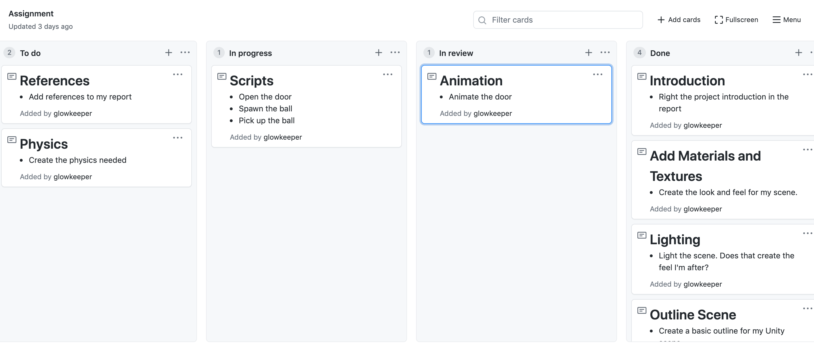
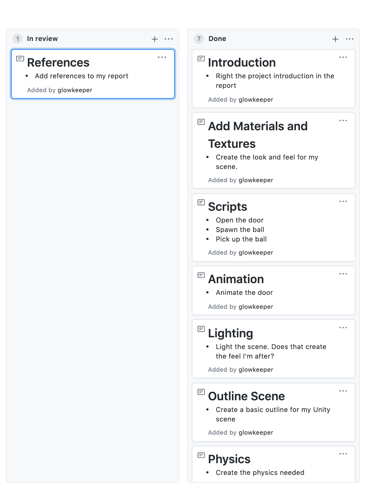
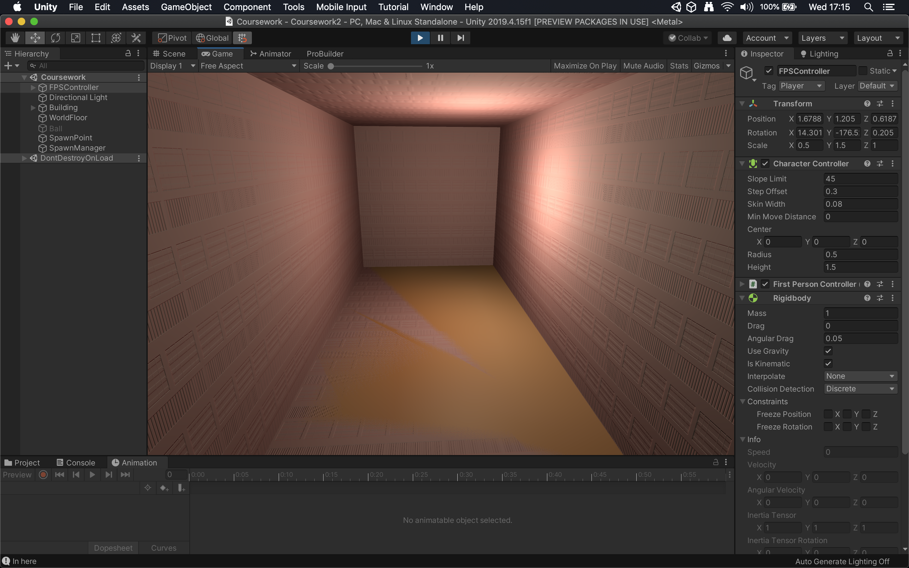

## Introduction

Building on the shipping container theme from the labs, my scene will feature two shipping containers stacked on top of one another. The first person controller (FPC) needs to pick up a ball and carry it up to the first floor, so each of the spaces where the FPC goes will need to be wide enough so that they have room for the FPC and ball. Hence, these are going to be the dimensions of my spaces:

+ Ground floor - 3m wide, x 3m high x 6m long.
+ First floor - 3m wide, x 3m high x 6m long.
+ Front (door) wall - 5m wide x 6m high x 0.1m deep.
+ Door - 2m wide x 2m high.
+ Outside building envelope - 5m wide, 6m high x 10m long.
+ Stairs - 2m wide x 3m high x 10m long. The steps will be a metre wide, except the top and bottom steps, which will each be two metres wide.

The first floor will be stacked two metres forward of the ground floor so that it creates an overhang. The stairs will rise to the left of the ground floor so that the top and bottom steps push beyond the ground floor by two metres each. The outside building envelope will encompass each of the front wall, ground and first floor rooms, as well as the stairs.

The scene will feature three scripts:

1. Open and close the door
2. Spawn the ball
3. Pick up and drop the ball

A key-press (E) will open the door once the FPC is within a trigger area. Once the player leaves the trigger area, the door will close. Another key-press (B) will spawn a ball towards the back of the ground floor. A third key-press (P) will pick up the ball by transforming to a point just in front of the FPC, which will carry the ball up the stairs. Finally, a key-press (L) will drop the ball, so it falls down the stairs.

### Project Plan

Below shows the planning of my project.

#### Setting up the Scene


_Figure 1: Initial plan_

#### Animating and Scripting



_Figure 2: Animating and scripting_

#### Completing the Scene



_Figure 3: Finished project_

## Technical Element

I used diffuse materials (Shirley, 2020) to attempt to recreate a post-industrial 'shipping container' feel to my scene...

## Script

The _PickUp.cs_ script below is attached to the first-person controller. It will pick up and drop the ball. Both the transform _pick up place_ and the name of that _pick up place_ are _serialised private_ fields; that way, they **are not** exposed to other game objects, but **are** exposed in the inspector window. That means the _PickUp.cs_ script is configurable should I choose to pick up objects other than a ball in my scene.

```
script goes here
```

## Animation

Figure 1, below, shows an animation controller for opening and closing the door.


_Figure 4: Door animation_

## Summary

My scene demonstrates all the essential elements introduced throughout the labs, such as lighting, materials and textures, 3D physics, first-person controllers, scripting and animation.

However, it is not without issues. Z-fighting (which is also called duplicate geometry, coplanar meshes, stitching or shimmering), is a phenomenon that can occur when rendering 3D graphics (Polycount wiki, 2020).  The effect is an on-screen flickering. Z-fighting is so-called because it is a problem associated with values held in a z-buffer (also known as a depth buffer), which is a data structure that determines whether a pixel is visible in a scene (Computer Hope, 2020). Z-fighting occurs when pixels have almost identical z-buffer values, whereby it is random which of those similar pixels gets rendered.

Figure 5, below, shows my scene exhibiting z-fighting - the result is that Unity is unable to decide whether it should render the shipping container floor or the ground upon which the container sits.



_Figure 5: Z-fighting_

There are several ways of fixing z-fighting, such as increasing the precision of the z-buffer or increasing the near clipping plane and decreasing the far clipping plane of the camera (Unity3d Tips, 2020). However, the most straightforward fix is to move objects so that they no longer clash. In the figure above, the camera should have rendered the ground floor of the building (not the terrain of the world), so the problem might have been solved by moving the building a fraction. However, that was problematic because the world terrain was not entirely flat.

Another problem was that there are occasions when the FPC appears to walk through the walls of my building. That is _probably_ an issue with the size of Unity colliders, so a possible fix might have been to modify the size of those.

Finally, there were lighting issues. For example, ambient light leaks through building corners, and point lights bleed through walls. I might have addressed that by investigating Unity's light mapping and scene baking, or by looking at the intensity, range and render mode of each of my point lights.

Given more time, I would have attempted to fix all of the issues described above.

## Future Work

I would have liked to have developed a coherent aesthetic for my scene, so future work might mean evolving that. I like science fiction, and I could attempt a kind of 'Blade Runner' look. Perhaps I could set a nighttime view and use neon lighting. Then I could place my shipping container amongst many other such containers, thus building a type of 'containerised' dystopian world.

It would be fun to gamify my scene, too. For example - building on the theme of the coursework, I could add a timing element when picking up the ball and throwing it down the stairs. For example, how quickly can you get to the top of the stairs with the ball and throw it back down stairs, so it hits the bottom step? Or how fast can you do that 10, 20, 30 times or more (that could be a configurable option in a script)?

## Appendix

Door.cs:

```
script here
```

Pickup.cs:

```
script here
```

Spawn.cs:

```
script here
```

## References

Below are all the references used in my application and report.

### GitHub

GitHub homepage: https://github.com/glowkeeper/P3D

Application directory: https://github.com/glowkeeper/P3D/src/assignment

### Asset References

+ [Standard Assets](https://assetstore.unity.com/packages/essentials/asset-packs/standard-assets-for-unity-2018-4-32351)
+ [Free Shipping Containers](https://assetstore.unity.com/packages/3d/environments/industrial/free-shipping-containers-18315)
+ [Old USSR Lamp](https://assetstore.unity.com/packages/3d/props/electronics/old-ussr-lamp-110400)
+ [PBR LAMPS PACK](https://assetstore.unity.com/packages/3d/props/interior/free-pbr-lamps-70181)
+ [Ball Pack](https://assetstore.unity.com/packages/3d/props/ball-pack-446)

### Script References

+ [Door opening](http://somewhere.com)
+ [Spawn ball](http://somewhere-else.com)
+ [Pick up ball](http://somewhere-else-again.com)

### Report References

+ Unity3d Tips, How To Fix Unity Z-Fighting With Multiple Solutions, Available at https://www.unity3dtips.com/unity-z-fighting-solutions/, Accessed November 2020
+ Computer Hope, Z-buffer, Available at https://www.computerhope.com/jargon/z/zbuffering.htm, Accessed November 2020
+ Polycount wiki, Z-fighting, Available at http://wiki.polycount.com/wiki/Z-Fighting), Accessed November 2020
+ Peter Shirley, 2020, Ray Tracing in One Weekend, Diffuse Materials. Available at https://raytracing.github.io/books/RayTracingInOneWeekend.html#diffusematerials, Accessed October 2020.
