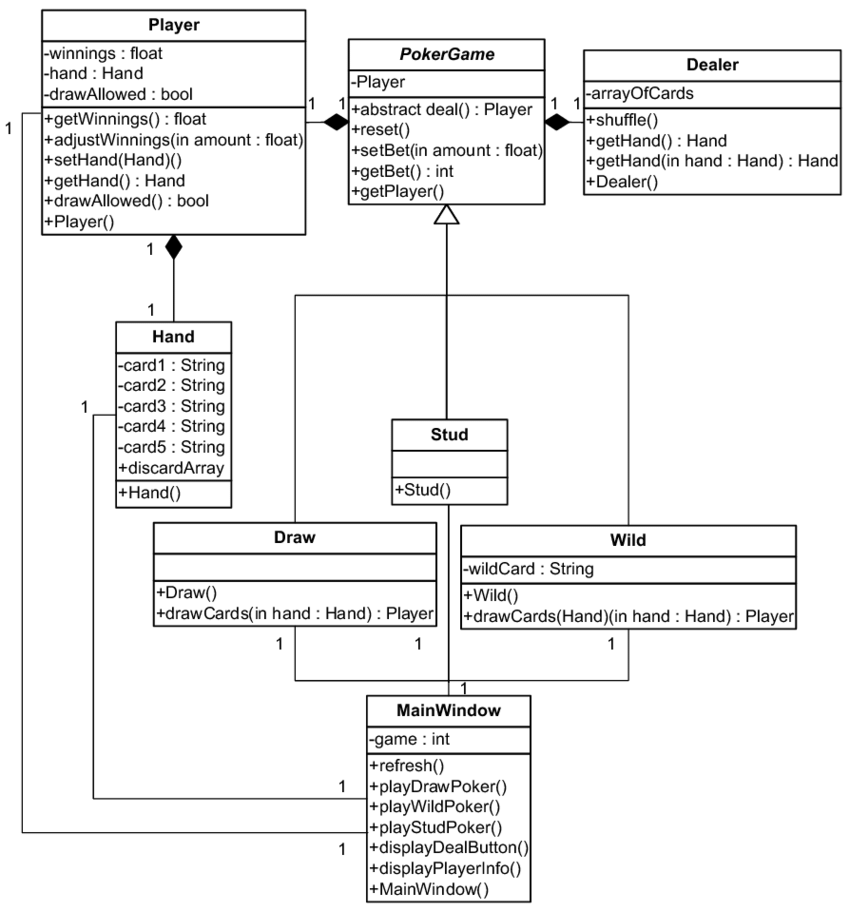

# Report Template

Below is a suggested template for your report.

---

## Introduction

Create some narrative that lays the foundation for your coursework...

### Planning


### Design



## Script

e.g. _The script below is attached to the third-person controller. It will destroy any object tagged with 'otherTag' and which has a collider marked as a trigger_

```c#
using System.Collections;
using System.Collections.Generic;
using UnityEngine;

public class Destroyer : MonoBehaviour
{
    [SerializeField] private string otherTag;

    private void OnTriggerEnter(Collider other)
    {
        if(other.gameObject.tag == otherTag )
        {
            Destroy(other.gameObject);
        }
    }
}
```

## Implementation

Describe the scene and the game you've built.

## A Research Element

A properly referenced research section that describes what you've done that goes beyond the material taught in the labs.

## Summary

Critique your coursework...

## Future Work

Describe how your coursework might evolve in the future...

## Appendix A

A link to your GitHub repository.

## Appendix B - Your Scripts

_Destroyer.cs_:

```c#
using System.Collections;
using System.Collections.Generic;
using UnityEngine;

public class Destroyer : MonoBehaviour
{
    [SerializeField] private string otherTag;

    private void OnTriggerEnter(Collider other)
    {
        if(other.gameObject.tag == otherTag )
        {
            Destroy(other.gameObject);
        }
    }
}
```

_SpawnObjects.cs_:

```c#
using System.Collections;
using System.Collections.Generic;
using UnityEngine;
using UnityEngine.UI;

public class SpawnObjects : MonoBehaviour
{
    [SerializeField] private GameObject mObject;
    [SerializeField] private Transform spawnPoint;
    [SerializeField] private int maxObjects;
    private List<GameObject> mObjects;
    private int numObjects;

    // Start is called before the first frame update
    void Start()
    {
        mObjects = new List<GameObject>();  
    }

    // Update is called once per frame
    void Update()
    {
        if (numObjects < maxObjects)
        {
            SpawnObject();
            numObjects++;
        } else {

            for (int i = 0; i < mObjects.Count; i++)
            {
                if (mObjects[i] == null)
                {
                    mObjects.RemoveAt(i);
                }
            }
        }        

    }

    void SpawnObject()
    {
        GameObject mObjectClone = Instantiate(mObject, spawnPoint.position, Quaternion.identity) as GameObject;
        mObjectClone.SetActive(true);
        mObjects.Add(mObjectClone);
    }
}
```

## Appendix C - Asset and Script References

+ [Standard Assets](https://assetstore.unity.com/packages/essentials/asset-packs/standard-assets-for-unity-2018-4-32351)
+ [Free Shipping Containers](https://assetstore.unity.com/packages/3d/environments/industrial/free-shipping-containers-18315)
+ [Old USSR Lamp](https://assetstore.unity.com/packages/3d/props/electronics/old-ussr-lamp-110400)
+ [PBR LAMPS PACK](https://assetstore.unity.com/packages/3d/props/interior/free-pbr-lamps-70181)
+ [Ball Pack](https://assetstore.unity.com/packages/3d/props/ball-pack-446)

...references to any scripts by other people that you've used. Give credit where credit's due!

### Appendix D - Report References

Peter Shirley, 2020, Ray Tracing in One Weekend, Diffuse Materials. Available at https://raytracing.github.io/books/RayTracingInOneWeekend.html#diffusematerials, Accessed October, 2023.
