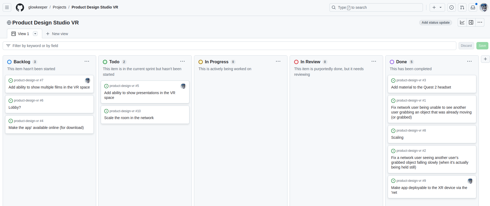

# Report Template

Below is a suggested template for your report (it follows the layout of the [marking criteria](./markingCriteria.md), so you are advised to make use of it).

## Introduction

Introduce a storyline/narrative that sets the foundation for the scene you've created and the game your TPC plays. You should use your GDD as inspiration here.

## Planning

.

_Figure 1: Kanban Board from Week 8_

## Modelling

Describe the structure you built, including any textures and lighting.

## 3D Physics

Some description of how you used 3D physics in your scene.

## Script

A snippet of a script you used in your game, alongside an explanation of it and how it was used. This is an opportunity to demonstrate your grasp of scripting.

## Multimedia

How you enhanced your scene using multimedia and sound.

## Highlights

Show where you went above and beyond the material taught in the labs. This section should include how you used that element in your Unity scene, thus making it unique.

## Summary

Summarise the game you've created. This section is an opportunity to critique what you've done.

## Future Work

Describe how your coursework might evolve in the future.

## Appendix A

Your GDD.

## Appendix B

A link to your GitHub repository.

## Appendix C

Your scripts.

## Appendix D

References to any assets you used.

## Appendix F

Report References.
