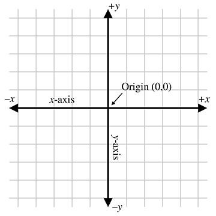
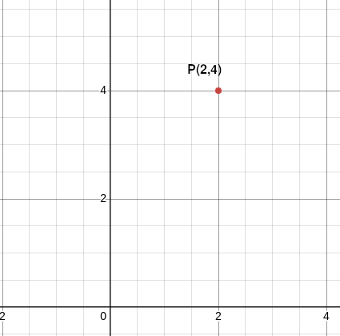
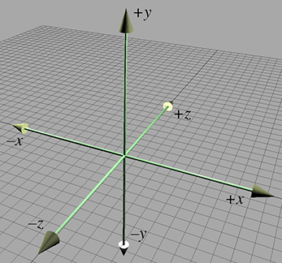
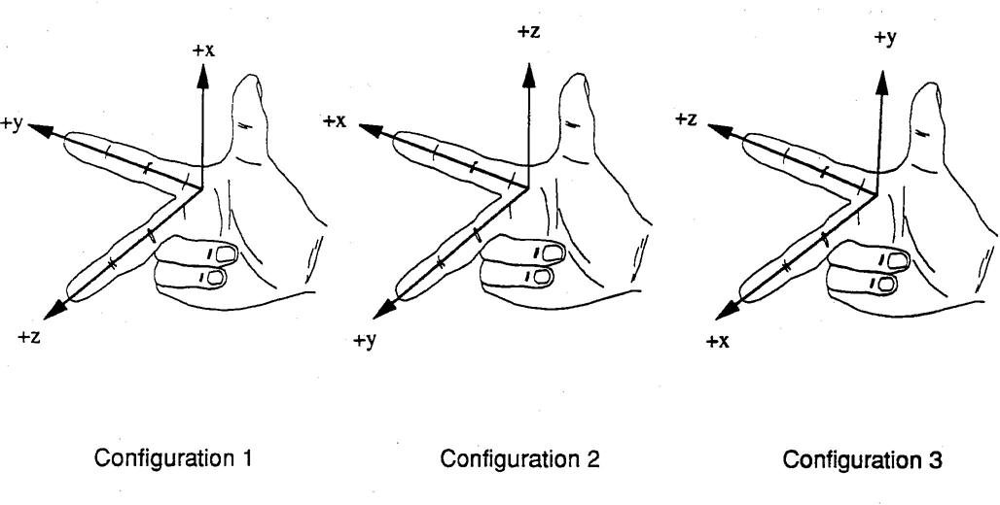
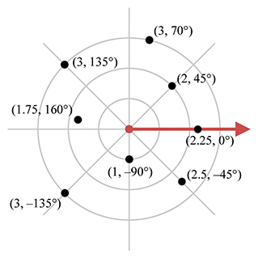
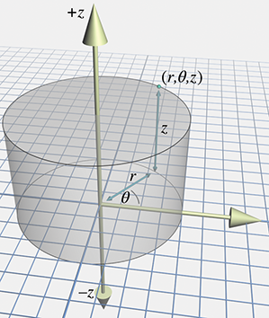

# Coordinate Systems

Three-dimensional (3D) maths measures locations, distances, and angles in 3D space. The most frequently used framework to perform such calculations is the Cartesian coordinate system, named after René Descartes, the French mathematician who developed the ideas behind Cartesian space and unified algebra and geometry.

## 2D Cartesian Space

Two pieces of information define a two-dimensional (2D) cartesian coordinate space:

1. The origin, which is the "centre" of the coordinate system
2. The axis, which is characterised by two straight lines that pass through the origin. The lines are perpendicular and extend infinitely in two opposite directions. Without other information, the mathematics convention is that the horizontal line is labelled _x_, and the vertical line is labelled _y_

A coordinate space is a framework for specifying location precisely; in 2D, two numbers are used to specify a location - the ordered pair (2,4) is an example of Cartesian coordinates. The first coordinate (the 2 in the example) is the _x coordinate_, and the second (the 4) is the _y coordinate_. Hence, the coordinate (2,4) specifies that you should move 2 points along the x-axis and 4 points along the y-axis.

## 3D Cartesian Space

3D cartesian space adds a third axis, the _z axis_, and therefore a third number to specify a location.

In 3D, any pair of axes defines a plane that is perpendicular to the third axis. So the plane containing the  _x_ and _y_ axes is the _xy_ plane, perpendicular to the _z_ axis. Since points in 3D cartesian spaces are specified using three numbers that define _x_, _y_ and _z_, respectively, they represent the distance to the _yz_, _xz_ and _xy_ planes. The distance is measured along a line parallel to the axis. For example, the _x_ value is the signed distance to the _yz_ plane, measured along a line parallel to the _x_ axis. It sounds more complicated, but it is just a straightforward extension of the 2D space.

## Left-handed and Right-handed 3D Coordinate Spaces

Unfortunately, in 3D, there are no standard conventions for the arrangement of the axes in diagrams and the assignment of the axes onto physical dimensions (left, right, up, down, forward, back). There are two distinct types of 3D coordinate spaces: left-handed coordinate spaces and right-handed coordinate spaces. The difference between these two spaces is that, with left-handed coordinate systems, the positive rotation is clockwise, but with right-handed coordinate systems, the positive rotation is counter-clockwise. These directions matter in 3D programming because they determine which way the normals face, thus affecting lighting.

There are several valid right-hand and left-hand configurations, so the best advice is to pick one and stick with it.

A fairly common method for either the left or right hand:

1. With your hand flat, point your fingers in the direction of X
2. Curl all fingers but your index finger to point towards Y
3. Raise your thumb. That's Z

That gives:

+x = Index finger
y = middle finger (and/or ring and little fingers) bent 90 degrees inward
+z = thumb sticking out

So, given an (x, y, z) coordinate frame, determine positive rotations:

1. Point your thumb in the direction of +X, or +Y, or +Z
2. The direction in which your fingers curl (and point) is the direction of positive rotation

[Unity](https://unity.com/) uses a left-handed coordinate system, whereas [Blender](https://www.blender.org/) uses a right-handed coordinate system, so should you export objects from Blender to Unity, the _x_ axis will be reversed, so that what was positive _x_ in Blender will be negative in Unity. _Usually_ this doesn't matter, as the model looks the same.

## Polar Coordinates

Although Cartesian coordinates are more common, polar coordinates are another system for referring to points in space. The polar coordinate system refers to those points using distances and angles, which take the form (r,θ). You probably use them more often than you realise. For instance, the author of this piece on polar coordinates lives near Brighton, in England, about 60 miles south of London. In other words, they've given an origin (London), a distance (60 miles), and an angle (south). In short, polar coordinates often arise because people naturally think about locations in terms of distance and direction. Therefore, the polar coordinate system is useful whenever we need to think in terms of distance and angle.

When working in two dimensions, polar coordinates take the form (r,θ), where, by convention, r (for radius - the value is referred to as the radial line) represents the distance, and θ (the Greek symbol _theta_) gives the polar angle from the origin (angles are discussed in more detail in [Trigonometry](./trigonometry.md)).

With three dimensions, there are two choices for polar coordinate systems. The first is cylindrical coordinates, denoted by (r,θ,z), where z is a third axis perpendicular to the 2D plane created by (r,θ). To locate the point described by the cylindrical coordinates (r,θ,z), you start by finding the point (r,θ) in the 2D polar coordinate space and then move up or down according to the sign of the z coordinate.

The second choice of polar coordinate system in three dimensions is the spherical coordinate system. The third value in the system is denoted φ, which is the angle of rotation about the meridian plane, which is the axis perpendicular to the 2D plane created by (r,θ). Hence, spherical polar coordinates take the form (r,θ,φ).

Sometimes, you may see spherical coordinates referred to using the more intuitive (r,h,p), where h refers to heading (similar to compass heading (north, south, etc.), borrowed from an aviation context), and p refers to pitch, which measures how much something is looking up or down.
