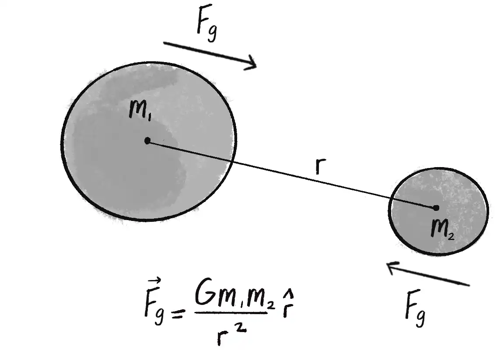

# Forces

This document describes the concept of a force and its relationship to acceleration. 

## Acceleration

Acceleration is the rate of change of velocity. In [vectors](./vectors.md]), we defined velocity as the rate of change of position, so in essence, we have _acceleration -> velocity -> postion_ because acceleration affects velocity, which in turn affects position. The motion of objects that accelerate has a kind of continuity and fluidity because their movement becomes dependent on a previous (accelerated) state.

Acceleration doesn’t merely refer to speeding up or slowing down; instead, it refers to any change in velocity—magnitude or direction.

## Force

Our definitions of force come from [Sir Isaac Newton’s three laws of motion](https://en.wikipedia.org/wiki/Newton%27s_laws_of_motion):

1. A body remains at rest, or in motion at a constant speed in a straight line, except insofar as it is acted upon by a force.
2. At any instant of time, the net force on a body is equal to the body's acceleration multiplied by its mass or, equivalently, the rate at which the body's momentum is changing with time.
3. If two bodies exert forces on each other, these forces have the same magnitude but opposite directions.

The first law is commonly stated as, "An object at rest stays at rest, and an object in motion stays in motion" (we could add, "...at a constant speed and direction unless acted upon by an unbalanced force"). As Newton established, in the absence of any forces, no force is required to keep an object moving. When a ball is tossed into the air, its velocity remains constant only in the absence of any forces or only if the forces that act on it cancel each other out, meaning the net force adds up to zero. This is often referred to as **equilibrium**. In reality, an object's velocity changes because of unseen forces such as air resistance and gravity; hence, the falling ball will reach a terminal velocity (which stays constant) once the force of air resistance equals the force of gravity. In other words, the first law could be restated as, "An object’s velocity vector will remain constant if it’s in a state of equilibrium".

Newton’s second law is commonly stated as, "Force equals mass times acceleration", or, mathematically:

F = ma

In other words, acceleration is directly proportional to force and inversely proportional to mass. Putting this into base terms - the harder you’re pushed, the faster you’ll fall. That is, unless you're large, in which case the push will be less effective.

The third law is more commonly described as, "For every action, there is an equal and opposite reaction". This could be refactored to, "Forces always occur in pairs. The two forces are of equal strength but in opposite directions". These forces do not cancel each other out because the forces act on different objects. And just because the two forces are equal doesn’t mean that the objects’ movements are equal (or that the objects will stop moving).

We can summarise Newton's three laws as:

**A force is a vector that causes an object with mass to accelerate**.

Furthermore, forces must accumulate. This is stated in the full definition of Newton’s second law, F = ma, which implicitly suggests that, "Net force equals mass times acceleration"; in other words, acceleration is equal to the sum of all forces divided by mass. Hence, if we ignore mass (set it to 1), as long as all the forces can be added together (accumulated), it doesn’t matter how many forces there are, the sum total will give you the object’s acceleration.

## Weight vs Mass

Mass is a measure of the amount of matter in an object (measured in kilograms in the metric system). An object that has a mass of 1 kilogram on Earth would also have a mass of 1 kilogram on the Moon (or anywhere else, for that matter).

Weight is the force of gravity on an object. From Newton’s second law, you can calculate weight as mass times the acceleration of gravity. Weight is measured in newtons (N), a unit that indicates the magnitude of a gravitational force (on earth, this is 9.8 N/kg). Because weight is tied to gravity, an object on the Moon weighs one-sixth as much as it does on Earth because the gravitational force there is weaker. Related to mass is density, which is defined as the amount of mass per unit of volume (grams per cubic centimeter, for example).

If you were to climb a ladder and drop two balls of different masses, they would hit the ground at the same time. Galileo made this discovery of simultaneous acceleration when he performed [a similar test in 1589](https://en.wikipedia.org/wiki/Galileo%27s_Leaning_Tower_of_Pisa_experiment). The reason is that everything cancels out; _gravity_ is calculated relative to an object’s mass—so that the bigger the object, the stronger the force—but then you divide by the _mass_ to determine the acceleration. Therefore, the acceleration of gravity for different objects is equal.

## Modeling Forces

Physics textbooks probably include many formulas describing various forces, such as gravity, electromagnetism, friction, tension, elasticity, and more.

Friction is the force that resists motion when two surfaces come into contact with each other. If the two surfaces do not move with respect to one another it is called static friction. When the two surfaces move and slide against each other it is called kinetic friction. Hence, friction is a dissipative force because it causes the kinetic energy of an object to be converted into another form, giving the impression of loss, or dissipation. Here's the formula for friction:

f = μN, where:

- f is the friction force, in newtons
- μ is the coefficient of friction, which establishes the strength of a friction force for a particular surface
- N is the normal force, in newtons, equal to N = mg, i.e. mass m times gravity g. It is the force perpendicular to the object’s motion along a surface.

Perhaps the best known force is gravitational attraction. Every object with mass exerts a gravitational force on every other object, and the gravitational force between two bodies is proportional to the mass of those bodies and inversely proportional to the square of the distance between them. The formula for calculating the strengths of those forces is given for reference below:

Where the numerator (the top half of the right-hand side of the equation) shows G, which is the universal [gravitational constant](https://en.wikipedia.org/wiki/Gravitational_constant), m1 and m2 are the masses of two objects and r is the unit vector pointing from object 1 to object 2. Because r is a unit vector, magnitude is ignored, so this shows direction alone (i.e. it's a direction vector), and it can be computed by subtracting the position of one object from the other. Finally, the denominator (the bottom half of the right-hand side of the equation) is the distance between the two objects squared.

The formula shows that the larger the numerator, the bigger the force due to mass. However, for the denominator, the opposite is true: the bigger the value (the farther away the object), the weaker the force. Mathematically, the strength of the gravitational force is inversely proportional to the distance squared. This is known as the [inverse square law](https://en.wikipedia.org/wiki/Inverse-square_law).

## The n-Body Problem

The n-body problem involves solving an equation for the motion of a group of objects that interact via gravitational forces. For two objects, the motions can be precisely computed. Adding one more body turns the problem into a three-body problem, for which no formal solution exists. However, that does not mean that it is impossible to model forces applied to n-bodies; for example, the paper [Classification of Symmetry Groups for Planar n-Body Choreographies](https://www.cambridge.org/core/journals/forum-of-mathematics-sigma/article/classification-of-symmetry-groups-for-planar-nbody-choreographies/710D0EC787DED736B64A94D0E5CD01E1) by James Montaldi and Katrina Steckles, explores choreographic solutions to the n-body problem (defined as periodic motions of bodies following one another at regular intervals).

## A Note on Time and Physics Engines

Newton's second law states that forces are accumulated and applied at some point in time. 3D physics engines incorporate time as a variable called _delta time_, where _delta_ refers to the **change in time**; indeed, in [Unity](https://unity.com/), _Time.deltaTime_ is the interval in seconds from the last frame to the current one.
