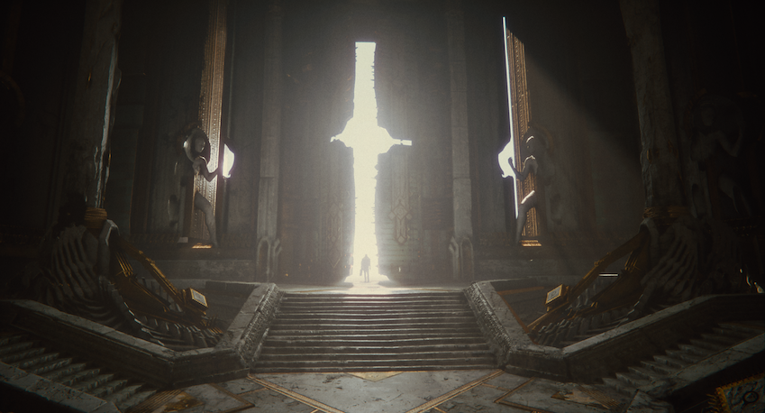

# Lab - Week 2, Session 2 - Meshes, Materials, Shaders and Textures

This lab introduces you to meshes, materials, textures and shaders in [Unity](https://unity.com/).

## Overview

Rendering in Unity relies on a close relationship between meshes, materials, shaders and textures; textures are applied to objects using materials, and materials use specialised graphics programs called shaders to render a texture onto the surface of a mesh.

+ [Meshes](https://docs.unity3d.com/Manual/AnatomyofaMesh.html) are a graphics primitive that define the shape of an object (you've already worked with meshes when using [ProBuilder](https://unity.com/features/probuilder) in the previous lab)
+ [Materials](https://docs.unity3d.com/Manual/Materials.html) define the properties of a surface of an object. They include references to textures and specifiy how those textures are tiled and coloured. 
+ [Shaders](https://docs.unity3d.com/Manual/Shaders.html) are small scripts that contain the algorithms for calculating the colour of each pixel.
+ [Textures](https://docs.unity3d.com/Manual/Textures.html) are [bitmap](https://en.wikipedia.org/wiki/Bitmap) images that define the fine detail of a material's surface; think of them as images that are printed on a rubber sheet and stretched and pinned onto a mesh.

Each material specifies which shader to use. The shader expects one or more texture variables, each of which can be assigned different texture assets (image files). Textures are applied to meshes using materials.Hence, there's a close link between materals, shaders, textures and the meshes to which they're applied.
