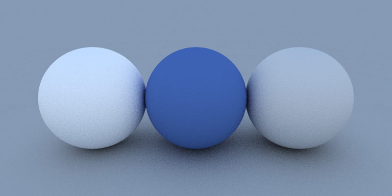
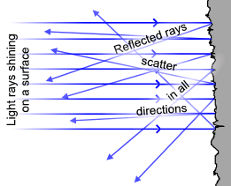

# Lab for Week 2, Session 1 - Diffuse Materials

This lab builds on the [previous lab](./week2Session1.md) by adding a material to the sphere.

## Overview

Light is invisible to us until it hits an object, when some of its energy is absorbed, and some is reflected. Hence, our perception of a material's colour and texture is based on the manner light rays reflect its surface. [Diffuse materials](https://raytracing.github.io/books/RayTracingInOneWeekend.html#diffusematerials) are matt surfaces that absorb much of the light they receive - the darker they are, the more light they absorb.



A diffuse surface [reflects light in random directions](https://viclw17.github.io/2018/07/20/raytracing-diffuse-materials/). Thus, diffuse reflection is when light is reflected from a surface and scattered at many angles (as opposed to specular reflection, when light is reflected at just one angle).



The [reading material](#reading-material) section contains some links giving more detail about diffuse materials.

## Simulating Diffuse Materials with Ray Tracing

The first algorithm you will use to generate a diffuse material considers two unit radius spheres that are tangent to the point _P_ of a surface ([a unit sphere](https://en.wikipedia.org/wiki/Unit_sphere) is a sphere whose surfaces are of distance 1 from a fixed central point). These two spheres have a centre of 1) _P + n_ and 2) _P - n_ (where _n_ is the normal to the surface) - sphere 1) is the outside surface, and sphere 2) is inside. Select the unit radius sphere that is on the same side as the ray origin and its tangent surface. Then pick a random point _S_ inside that sphere and send a ray from the hit point _P_ to the random point _S_. To generate that random point, a _rejection algorithm_ is used, which rejects all points generated inside a random point within a cube until it finds a point on the inside of the tangent sphere.

To implement that algorithm, modify `vec3.h` from [Week 1, Session 2](./week1Session2):

```
#ifndef VEC3_H
#define VEC3_H

#include <cmath>
#include <iostream>

using std::sqrt;

class vec3 {
    public:
        vec3() : e{0,0,0} {}
        vec3(double e0, double e1, double e2) : e{e0, e1, e2} {}

        double x() const { return e[0]; }
        double y() const { return e[1]; }
        double z() const { return e[2]; }

        vec3 operator-() const { return vec3(-e[0], -e[1], -e[2]); }
        double operator[](int i) const { return e[i]; }
        double& operator[](int i) { return e[i]; }

        vec3& operator+=(const vec3 &v) {
            e[0] += v.e[0];
            e[1] += v.e[1];
            e[2] += v.e[2];
            return *this;
        }

        vec3& operator*=(const double t) {
            e[0] *= t;
            e[1] *= t;
            e[2] *= t;
            return *this;
        }

        vec3& operator/=(const double t) {
            return *this *= 1/t;
        }

        double length() const {
            return sqrt(length_squared());
        }

        double length_squared() const {
            return e[0]*e[0] + e[1]*e[1] + e[2]*e[2];
        }

        inline static vec3 random() {
            return vec3(random_double(), random_double(), random_double());
        }

        inline static vec3 random(double min, double max) {
            return vec3(random_double(min,max), random_double(min,max), random_double(min,max));
        }

    public:
        double e[3];
};

// Type aliases for vec3
using point3 = vec3;   // 3D point
using color = vec3;    // RGB color

// vec3 Utility Functions

inline std::ostream& operator<<(std::ostream &out, const vec3 &v) {
    return out << v.e[0] << ' ' << v.e[1] << ' ' << v.e[2];
}

inline vec3 operator+(const vec3 &u, const vec3 &v) {
    return vec3(u.e[0] + v.e[0], u.e[1] + v.e[1], u.e[2] + v.e[2]);
}

inline vec3 operator-(const vec3 &u, const vec3 &v) {
    return vec3(u.e[0] - v.e[0], u.e[1] - v.e[1], u.e[2] - v.e[2]);
}

inline vec3 operator*(const vec3 &u, const vec3 &v) {
    return vec3(u.e[0] * v.e[0], u.e[1] * v.e[1], u.e[2] * v.e[2]);
}

inline vec3 operator*(double t, const vec3 &v) {
    return vec3(t*v.e[0], t*v.e[1], t*v.e[2]);
}

inline vec3 operator*(const vec3 &v, double t) {
    return t * v;
}

inline vec3 operator/(vec3 v, double t) {
    return (1/t) * v;
}

inline double dot(const vec3 &u, const vec3 &v) {
    return u.e[0] * v.e[0]
         + u.e[1] * v.e[1]
         + u.e[2] * v.e[2];
}

inline vec3 cross(const vec3 &u, const vec3 &v) {
    return vec3(u.e[1] * v.e[2] - u.e[2] * v.e[1],
            u.e[2] * v.e[0] - u.e[0] * v.e[2],
            u.e[0] * v.e[1] - u.e[1] * v.e[0]);
}

inline vec3 unit_vector(vec3 v) {
    return v / v.length();
}

vec3 random_in_unit_sphere() {
    while (true) {
        auto p = vec3::random(-1,1);
        if (p.length_squared() >= 1) continue;
        return p;
    }
}

vec3 random_unit_vector() {
    auto a = random_double(0, 2*pi);
    auto z = random_double(-1, 1);
    auto r = sqrt(1 - z*z);
    return vec3(r*cos(a), r*sin(a), z);
}

#endif
```

Also update the `ray_colour` function in `main.cpp` from [Week 2, Session 1](./week2Session1.md). Notice that `ray_color` is now _recursive_ and that it uses `max_depth` to limit how many recursive calls are made. That ensures that the function will always return because if the ray fails to hit a surface after fifty tries, the function ends and returns the colour white.

```
#include "helpers.h"

#include "color.h"
#include "hittable_list.h"
#include "sphere.h"
#include "camera.h"

#include <iostream>

color ray_color(const ray& r, const hittable& world, int depth) {
    hit_record rec;

    // If we've exceeded the ray bounce limit, no more light is gathered.
    if (depth <= 0)
        return color(0,0,0);

    // Avoid Shadow Acne by ignoring hits very near zero
    if (world.hit(r, 0.001, infinity, rec)) {
        point3 target = rec.p + rec.normal + random_in_unit_sphere();
        return 0.5 * ray_color(ray(rec.p, target - rec.p), world, depth-1);
    }

    vec3 unit_direction = unit_vector(r.direction());
    auto t = 0.5*(unit_direction.y() + 1.0);
    return (1.0-t)*color(1.0, 1.0, 1.0) + t*color(0.5, 0.7, 1.0);
}

int main() {

    // Image

    const auto aspect_ratio = 16.0 / 9.0;
    const int image_width = 400;
    const int image_height = static_cast<int>(image_width / aspect_ratio);
    const int samples_per_pixel = 100;    
    const int max_depth = 50;

    // World
    hittable_list world;
    world.add(make_shared<sphere>(point3(0,0,-1), 0.5));
    world.add(make_shared<sphere>(point3(0,-100.5,-1), 100));

    // Camera
    camera cam;

    // Render

    std::cout << "P3\n" << image_width << ' ' << image_height << "\n255\n";

    for (int j = image_height-1; j >= 0; --j) {
        for (int i = 0; i < image_width; ++i) {
            color pixel_color(0, 0, 0);
            for (int s = 0; s < samples_per_pixel; ++s) {
                auto u = (i + random_double()) / (image_width-1);
                auto v = (j + random_double()) / (image_height-1);
                ray r = cam.get_ray(u, v);                
                pixel_color += ray_color(r, world, max_depth);
            }
            write_color(std::cout, pixel_color, samples_per_pixel);
        }
    }
}
```

Compile and run the program:

```
# g++ -o imageCreator main.cpp && ./imageCreator > image.ppm
```

You should not have your first diffuse material sphere:


### Gamma Correction

The sphere generated above is dark because it has not been [gamma corrected](https://en.wikipedia.org/wiki/Gamma_correction). Gamma correction is a process by which the [bits](https://en.wikipedia.org/wiki/Bit) that make up an image are transformed to take advantage of how we perceive light and colour. Human perception of brightness approximates a power function with greater sensitivity to relative differences between darker tones than the differences between lighter tones.

Modify `color.h` so that its `write_color` function uses a simple _gamma 2_ algorithm that approximates our perception of light by taking the square root of the generated colour (raising each colour to the power of a 1/2).

```
#ifndef COLOR_H
#define COLOR_H

#include "vec3.h"
#unbclude "helpers.h"

#include <iostream>

void write_color(std::ostream &out, color pixel_color, int samples_per_pixel) {
    auto r = pixel_color.x();
    auto g = pixel_color.y();
    auto b = pixel_color.z();

    // Divide the color by the number of samples and gamma-correct for gamma=2.0.
    auto scale = 1.0 / samples_per_pixel;
    r = sqrt(scale * r);
    g = sqrt(scale * g);
    b = sqrt(scale * b);

    // Write the translated [0,255] value of each color component.
    out << static_cast<int>(256 * clamp(r, 0.0, 0.999)) << ' '
        << static_cast<int>(256 * clamp(g, 0.0, 0.999)) << ' '
        << static_cast<int>(256 * clamp(b, 0.0, 0.999)) << '\n';
}

#endif
```

Compile and run the program:

```
# g++ -o imageCreator main.cpp && ./imageCreator > image.ppm
```

You should see a gamma corrected diffuse material sphere that is significantly lighter than the image generated above.


### Lambertian Reflection

The algorithms you have used to generate  diffuse materials above have tried to approximate the ideal of [Lambertian reflectance](https://en.wikipedia.org/wiki/Lambertian_reflectance), which defines a diffusely reflecting surface where the perceived brightness of the surface is the same regardless of the observer's angle of view (unfinished wood exhibits Lambertian reflectance).

For example, the rejection algorithm, described above, produces random points in the unit sphere that are offset along the surface normal. That produced a probability function that favoured rays whose directions were close to the normal. The outcome was that light which arrived at shallow angles and which spreads over a larger area contributed less to the final colour. However, [true Lambertian reflection](https://raytracing.github.io/books/RayTracingInOneWeekend.html#diffusematerials/truelambertianreflection) maintains a uniform distribution for high probability rays that are scattered close to the normal. Hence, true Lambertian reflection is achieved by normalising points inside a diffuse material.

Above, when you modified `vec3.h`, you also imported the function `random_unit_vector`, which you can use as a replacement for the function `random_in_unit_sphere` within `ray_color` in `main.cpp`, thereby achieving the desired normalisation.

```
#include "helpers.h"

#include "color.h"
#include "hittable_list.h"
#include "sphere.h"
#include "camera.h"

#include <iostream>

color ray_color(const ray& r, const hittable& world, int depth) {
    hit_record rec;

    // If we've exceeded the ray bounce limit, no more light is gathered.
    if (depth <= 0)
        return color(0,0,0);

    // Avoid Shadow Acne by ignoring hits very near zero
    if (world.hit(r, 0.001, infinity, rec)) {
        point3 target = rec.p + rec.normal + random_unit_vector();
        return 0.5 * ray_color(ray(rec.p, target - rec.p), world, depth-1);
    }

    vec3 unit_direction = unit_vector(r.direction());
    auto t = 0.5*(unit_direction.y() + 1.0);
    return (1.0-t)*color(1.0, 1.0, 1.0) + t*color(0.5, 0.7, 1.0);
}

int main() {

    // Image

    const auto aspect_ratio = 16.0 / 9.0;
    const int image_width = 400;
    const int image_height = static_cast<int>(image_width / aspect_ratio);
    const int samples_per_pixel = 100;    
    const int max_depth = 50;

    // World
    hittable_list world;
    world.add(make_shared<sphere>(point3(0,0,-1), 0.5));
    world.add(make_shared<sphere>(point3(0,-100.5,-1), 100));

    // Camera
    camera cam;

    // Render

    std::cout << "P3\n" << image_width << ' ' << image_height << "\n255\n";

    for (int j = image_height-1; j >= 0; --j) {
        for (int i = 0; i < image_width; ++i) {
            color pixel_color(0, 0, 0);
            for (int s = 0; s < samples_per_pixel; ++s) {
                auto u = (i + random_double()) / (image_width-1);
                auto v = (j + random_double()) / (image_height-1);
                ray r = cam.get_ray(u, v);                
                pixel_color += ray_color(r, world, max_depth);
            }
            write_color(std::cout, pixel_color, samples_per_pixel);
        }
    }
}
```

Compile and run the program:

```
# g++ -o imageCreator main.cpp && ./imageCreator > image.ppm
```

You should now have a diffuse sphere with true Lambertian reflection:


## Summary

You have now completed the C++ labs, which have offered an introduction to some of the ray tracing techniques for rendering 3D objects. There is much more to the subject, and for those interested, [Ray Tracing in One Weekend](https://raytracing.github.io/books/RayTracingInOneWeekend.html) provides more detail (including some of the maths). For example, it shows you how to use C++ to generate other materials and describes a much more advanced camera.

The remainder of the module uses [Unity](https://unity3d.com/unity/qa/lts-releases), where you will apply some of the knowledge gained during these labs.

## Reading Materials

+ [Ray Tracing in One Weekend](https://raytracing.github.io/books/RayTracingInOneWeekend.html)
+ [Materials - Diffuse, Reflection, Transparency](https://www.suplugins.com/podium/help/materials-drt.php)
+ [Ray Tracing - Diffuse Materials](https://viclw17.github.io/2018/07/20/raytracing-diffuse-materials/)
