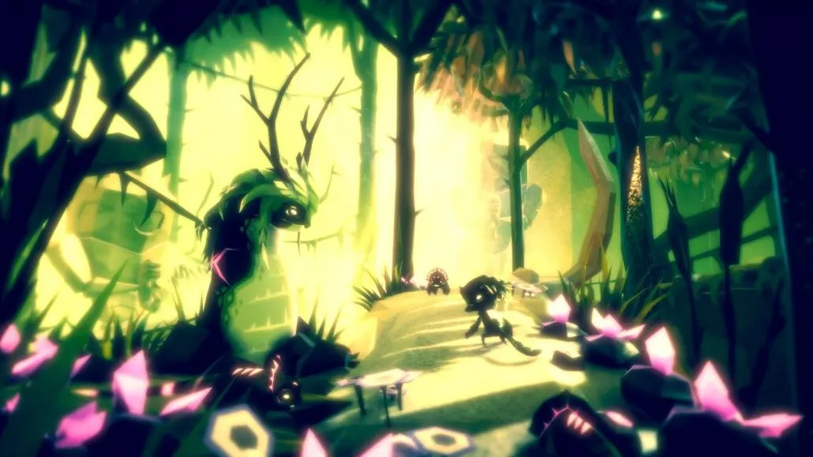
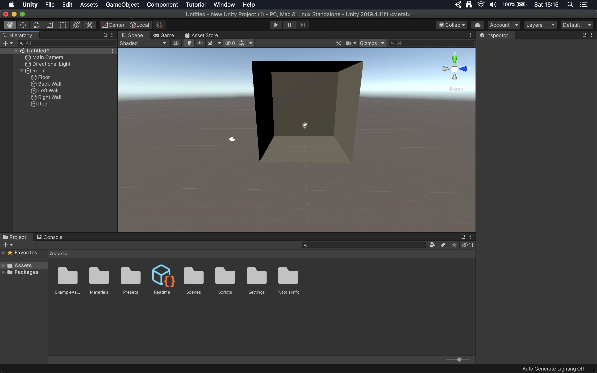

# Lab for Week 3, Session 1 - Graphics in Unity - Lighting

This lab introduces you to graphics and lighting in [Unity](https://unity.com/).

## Overview

Unity comes with a range of lighting techniques whose aim is to approximate the reality of light's behaviour. The result is that Unity can generate photo-realistic graphics, or, as in Figure 1, something much more stylised.

_Figure 1: [Fe](https://www.ea.com/games/fe)_

Unity models direct and indirect light - to get realistic effects, you must combine both. Direct light is emitted from a source, hits a surface, and gets reflected directly into a sensor (such as a virtual camera). Indirect light is all other light; it includes ambient environmental light that comes from the sky, which may have been reflected many times from different surfaces before it reaches a sensor.

Unity uses a global illumination (GI) system that is currently supported by two separate systems, 1) Realtime GI and 2) Baked GI. Realtime lighting is calculated at runtime. Baked lighting is light data that is computed in advance and gets _applied_ at runtime (rather than calculated). Ultimately, the difference is a trade-off between runtime performance (realtime lighting) and the time it takes to render your 3D graphics beforehand (baked lighting).

All of Unity's render pipelines support Baked GI. Realtime lighting is going to get removed entirely but remains available in Unity's legacy rendering systems.

## Lighting a Simple Scene

Below, you will create a simple scene that introduces some of the lighting capabilities of Unity.

### A Simple Room

Open [Unity Hub](https://docs.unity3d.com/Manual/GettingStartedUnityHub.html), create a new project and choose the Universal Render Pipeline (URP) template (naming the project however you choose).

The loaded URP sample scene is an opportunity to play with Unity's lighting systems. Figure 2 shows the rotational tool being used to change the direction of lighting. When you do the same, notice how it affects the workshop's shadows.

_Figure 2: Lighting the sample scene_

However, you are not going to use the sample scene; instead, you are going to create your own, so click on _File_, _New Scene_. You are going to model a room with no windows, so first set up the project to support that. Go to _Window_, _Rendering_, _Lighting Settings_, set _Skybox Material_ to _None_ and turn on _Ambient Occlusion_. Also, set _Lighting Mode_ to _Baked Indirect_ and turn on _Auto Generate_. At this point, you may also wish to set the Main Camera's _Background Type_ to a _Solid Colour_ and turn it black, so your room stands out in the Game tab. Later on in the module, you will use _Post Processing_ rendering, so take the opportunity to turn that on, too.

Now create five copies of _GameObject_, _3D Object_, _Plane_, which you should transform to model a simple room similar to that shown in Figure 3. Also, create an empty _GameObject_, move the five planes into that, rename it to _Room_ and make it _static_ so Unity can pre-compute some of the properties of your room. You may also wish to rename your five planes appropriately, too.

_Figure 3: A simple room_

Now is an excellent time to save your newly created scene and project.

You are going to light up your scene. First, we're going to need a lamp asset, so go to the [unity asset store](https://assetstore.unity.com/), and add the free [PBR LAMPS PACK](https://assetstore.unity.com/packages/3d/props/interior/free-pbr-lamps-70181) to your Unity assets. Now download and import that into your project. Before you can use the imported lamps, you must update them to use URP; so go to _Edit_, _Render Pipeline_, _Universal Render Pipeline_, _Upgrade Project Materials ..._. Drag the _Large round lamp_ [prefab](https://docs.unity3d.com/Manual/Prefabs.html) into your room in the scene, and use a transform to position it in the middle of your ceiling. Ensure the lamp is facing into the room.  

Currently, the lamp does not emit any light, so you are going to change that by adding a _Point Light_ to it; do so by going to _GameObject_, _Light_, _Point Light_. Move it until it looks as though the lamp is emitting light and play around with the settings until you find a colour and intensity that you like. Additionally, currently, this is supposed to be an inside scene, so we do not want ambient directional light to have an affect. There are a number of ways to achieve this; first (and probably best), is to switch the directional light's _Mode_ from _Realtime_ to _Baked_, when it appears to obey the geometry much better (since there is no front wall at the moment, you may need to change some parameters to ensure the light is not affecting the room). Secondly, you could simply delete the _Directional Light_. Figure 4 shows the Game tab with the _Directional Light_ deleted, and the _Point Light_ added to the lamp.

_Figure 4: A simple room with added materials_

Save your scene and save your project. You will add to this in the [next lab](./week3Session2.md).

## Useful Links

+ [Unity Tutorials](https://learn.unity.com/tutorials)
+ [LEARN UNITY](https://www.youtube.com/watch?v=pwZpJzpE2lQ)
+ [BRACKEYS](https://www.youtube.com/user/Brackeys)
+ [SYKOOTV](https://www.youtube.com/user/SykooTV)
+ [Lighting](https://docs.unity3d.com/Manual/LightingOverview.html)
+ [Tutorial - Introduction to Lighting and Rendering](https://learn.unity.com/tutorial/introduction-to-lighting-and-rendering-2019-3)
+ [Types of Light](https://docs.unity3d.com/Manual/Lighting.html)
