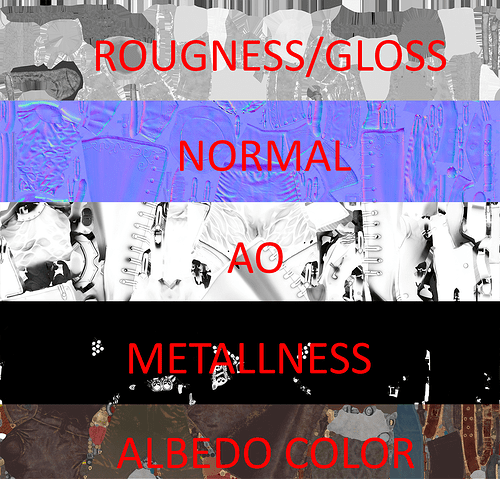

# Week 3, Session 1 - Materials, Textures  and Shaders

The goal of this session is to add some materials to the modelling you did in the last lab.

## Materials, Textures and Shaders

In the last session, we looked at [Models](https://docs.unity3d.com/Manual/models.html), which are files that contain various data, including meshes, materials and textures.

+ [Meshes](https://docs.unity3d.com/Manual/mesh.html) are a graphics primitive that defines the shape of an object
+ [Materials](https://docs.unity3d.com/Manual/Materials.html) define the properties of the surface of an object. They include references to textures and specify how those textures are tiled and coloured
+ [Shaders](https://docs.unity3d.com/Manual/Shaders.html) are small scripts that contain the algorithms for calculating the colour of each pixel
+ [Textures](https://docs.unity3d.com/Manual/Textures.html) are [bitmap](https://en.wikipedia.org/wiki/Bitmap) images that define the fine detail of a material's surface; think of them as images that are printed on a rubber sheet and stretched and pinned onto a mesh

_Figure 1: Left: a 3D polygon mesh of a player character. Right: the player mesh rendered with materials_

[Rendering](https://docs.unity3d.com/Manual/render-pipelines.html) is the process by which models get displayed on a screen (two common rendering techniques are [raytracing and rasterisation](https://blogs.nvidia.com/blog/whats-difference-between-ray-tracing-rasterization/) + an in-depth look at those techniques is beyond the scope of this module. Still, you can investigate them further, should you so wish).

Rendering relies on a close relationship between meshes, materials, shaders, and textures. Textures are applied to objects using materials, and materials use specialised graphics programs called shaders to render a texture onto the surface of the mesh. Unity's [standard shader](https://docs.unity3d.com/Manual/shader-StandardShader.html) is often a good choice as it is highly customisable and can render many surface types. However, there may be occasions where a custom [Shader Graph](https://docs.unity3d.com/Manual/shader-graph.html) or a [custom written shader](https://docs.unity3d.com/Manual/shader-writing.html) may be appropriate; examples could be if you are creating liquids or some highly-specialised artistic special effects.

## UV Mapping

The process of applying textures to meshes is known as "UV Mapping", where "UV" refers to the texture coordinates, called [texels](https://en.wikipedia.org/wiki/Texel_(graphics)), which use the coordinates (u, v) in 2D texture space and are named u and v to avoid naming collisions with the axis of a 3D world space: x,y,z. To know more about such coordinates, please refer to [coordinate systems](../coordinateSystems.md).

When a textured model is rendered, the u,v coordinates of the texture are mapped to the [vertices](https://en.wikipedia.org/wiki/Vertex_(computer_graphics)) of the model.
By convention, (u,v) of (0,0) corresponds to the bottom-left corner of the texture, and (u,v) of (1,1) – to the top-right.

Sometimes, the ranges of u and v can go beyond (0,1). In such cases, "texture addressing mode" is applied, which describes how to extend the texture beyond its original size. Well-known modes are "wrap", "mirror", "clamp", and "border colour".

## Texture Mapping Types

Many types of textures are mapped onto models. They are used for different purposes. Below are some of the more common maps and their uses.

_Figure 2: Different types of maps_

+ Diffuse/Colour/Albedo maps: The standard texture that adds colour to a model
+ Normal maps: Instead of colour, normal maps represent shape by adding extra detail to a low-detail version of a model so that it simulates the same reflections as the high-detail (and computationally expensive) version. Hence, normal maps store data about how light reflects from a surface, where each pixel represents the light's direction

_Figure 3: A normal mapped model (left), the mesh without the map (centre), and the normal map alone (right). Image courtesy of [PolyCount](http://wiki.polycount.com/wiki/Normal_map)_

+ Height maps: Height mapping (parallax mapping) is similar (but more complex and less performant) to normal mapping. Heightmaps define surfaces where the texture maps are responsible for rendering large bumps and protrusions.
+ Ambient Occlusion/AO map: These add extra shadow details to the model to simulate real-life shadowing more efficiently than computing the shadowing in real-time
+ Metalness map: These maps store how shiny a surface is. They are used with [physically based rendering (PBR)](https://pbr-book.org/) techniques to simulate realistic lighting scenarios more accurately
+ Roughness/Gloss map: These add the look of 'roughness' to a texture, and they are also used in PBR scenarios

## Exercise

Apply materials to the modelling you did in the last lab.

## Links

+ [Materials](https://docs.unity3d.com/Manual/Materials.html)
+ [Textures](https://docs.unity3d.com/Manual/Textures.html)
+ [Shaders](https://docs.unity3d.com/Manual/Shaders.html)
+ [Normal Map](https://docs.unity3d.com/Manual/StandardShaderMaterialParameterNormalMap.html)
+ [Vertices](https://en.wikipedia.org/wiki/Vertex_(computer_graphics))
+ [Raytracing and Rasterisation](https://blogs.nvidia.com/blog/whats-difference-between-ray-tracing-rasterization/)
+ [Physically based rendering (PBR)](https://pbr-book.org/)
+ [Coordinate Systems](../coordinateSystems.md)
