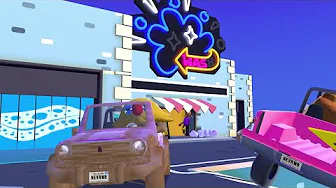
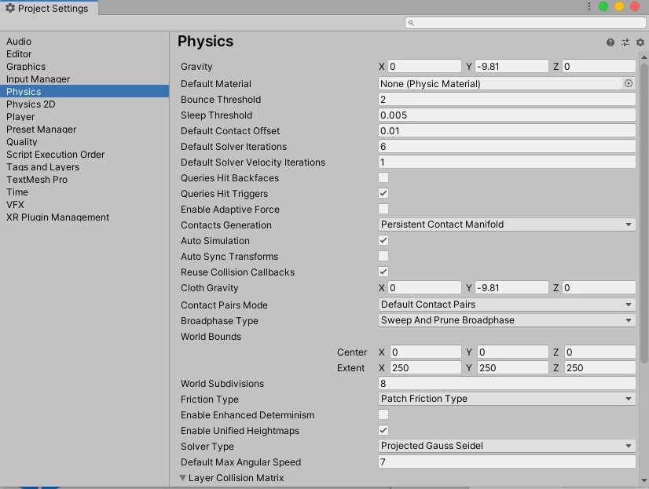
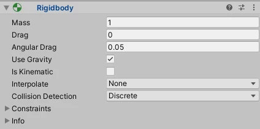

# Lab - Week 3, Session 2 - 3D Physics in Unity

The lab focuses on:

+ Rigidbodies
+ Kinematics
+ Colliders
+ Static and Dynamic Colliders
+ Physics Materials
+ Triggers

This lab demonstrates Unity's [built-in 3D Physics](https://docs.unity3d.com/Manual/PhysicsOverview.html), and not the recently-out-of-preview [Data-Oriented Technology Stack (DOTS)](https://unity.com/dots). Besides, DOTS is aimed at large, complex applications/games; for smaller applications (such as the ones we'll be building in the labs), Unity's built-in 3D physics platform remains the best choice. However, should you be using DOTS already, then you are welcome to use that for your coursework.

[_Making Custom Car Physics_](https://www.youtube.com/watch?v=CdPYlj5uZeI&t=2s)

## Overview

In this setting, 3D physics refers to the properties of objects and how they respond to forces. Unity's built-in physics engine has a breadth of tools that ensure objects can interact with other objects by approximating natural forces, such as gravity, velocity, acceleration, and friction. Figure 1 shows the properties of Unity's 3D physics engine.

_Figure 1: Unity's physics properties_

### Rigidbodies

Figure 2 shows that a rigidbody is the main component that enables physical behaviour for a game object. A rigidbody is a term borrowed from the realworld - it is an idealised object that does not deform under the influence of external forces; instead, it maintains its shape and size, making it ideal for analysing mechanical systems in physics and engineering (and also for modelling idealised physical systems in Unity!).

A Unity rigidbody also detects and resolves collisions between colliders (see below).

Since a rigidbody component is responsible for the movement of the game object to which it attached, you shouldn't try to move the game object by changing its _Transform_ properties in a script (we'll look at scripting later in the module). Instead, you should [apply forces to push the GameObject](https://docs.unity3d.com/Manual/RigidbodiesOverview.html) and let the physics engine calculate the results.

_Figure 2: Rigidbody_

#### Kinematics

Kinematic is the branch of mechanics that deals with bodies’ movement. It describes their motion without getting into the causes of motion, such as gravitational force, and torque.

That is why When something is _Kinematic_ in Unity, the physics behaviour of its rigidbody component is disabled, so it does not get affected by external forces; a _Kinematic Rigidbody_ can still push another rigidbody, but it cannot be pushed. Importantly, A _Kinematic Rigidbody_ still collides with other rigid bodies - that makes them ideal for platforms and elevators, because you want such things to maintain a path while still having the ability to transport that which they've collided (such as a player controller).

### Colliders

Colliders allow Unity to register when two objects interact. They define the [physical collision shape of a game object](https://docs.unity3d.com/Manual/CollidersOverview.html), such that, a game object will react to incoming collisions if it has a rigidbody component that is associated with one or more _Collider_ components. Colliders are invisible and do not need to match the shape of their associated game object mesh. The primitive _colliders_, _Box Collider_, _Sphere Collider_ and _Capsule Collider_ are the most straightforward and least processor-intensive.

#### Static and Dynamic Colliders

Game objects with colliders without a rigidbody are **static**, in that they won't move when they interact with other colliders; hence, they're useful for modelling motionless scene objects, such as walls and floors.

A game object that has a rigidbody and a collider are known as dynamic.

#### Physics Materials

When colliders interact, their surfaces should simulate the properties of the material they are supposed to represent. For example, a pane of glass should be slippery, but a rubber ball should not; however, it should be bouncy! Physics materials allow the configuration of the friction and bounce of the colliders to which they're attached.

### Triggers

_Triggers_ function similarly to _colliders_. However, when _triggers_ interact with _colliders_, they are ignored by the physics engine. Instead, they can execute scripts, which means they are useful for triggering all types of events; examples are some action when a _collider_ enters an area, tutorial messages or [cutscenes](https://en.wikipedia.org/wiki/Cutscene). You will take advantage of _triggers_ later in the module.
