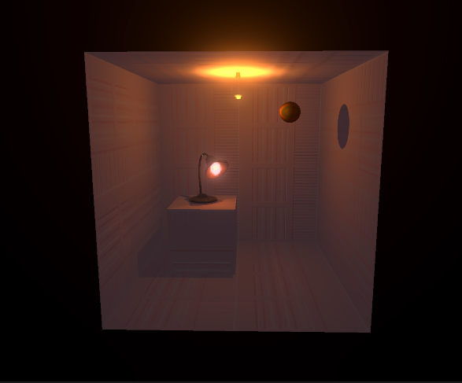
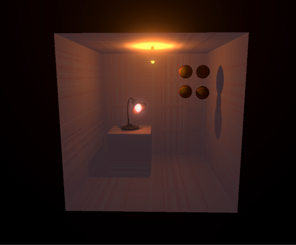
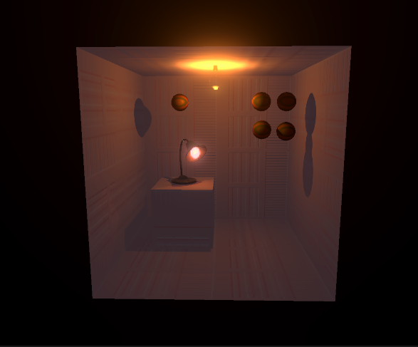

# Lab - Week 3, Session 2 - 3D Physics in Unity

The lab focuses on:

+ Rigidbodies
+ Colliders
+ Triggers

This lab demonstrates Unity's [built-in 3D Physics](https://docs.unity3d.com/Manual/PhysicsOverview.html), and not the recently-out-of-preview [Data-Oriented Technology Stack (DOTS)](https://unity.com/dots). Besides, DOTS is aimed at larger applications/games; for smaller applications (such as the ones we'll be building in the labs), Unity's built-in 3D physics platform remains the best choice. However, should you be using DOTS already, then you are welcome to use that for your coursework.

## Overview

In this setting, 3D physics refers to the properties of objects and how they respond to forces. Unity's built-in physics engine has a breadth of tools that ensure objects can interact with other objects by approximating natural forces, such as gravity, velocity, acceleration, and friction. Figure 1 shows the properties of Unity's 3D physics engine.

### Rigidbodies

_Figure 1: Unity's physics properties_

Figure 2 shows that a _RigidBody_ is the main component that enables physical behaviour for a _GameObject_. Since a _Rigidbody_ component is responsible for the movement of the _GameObject_ to which it attached, you shouldn't try to move the _GameObject_ by changing its _Transform_ properties in a script (we'll look at scripting later in the module). Instead, you should [apply forces to push the GameObject](https://docs.unity3d.com/Manual/RigidbodiesOverview.html) and let the physics engine calculate the results.

_Figure 2: RigidBody_

### Colliders

_Colliders_ allow Unity to register when two objects interact. They define the [physical collision shape of a _GameObject_](https://docs.unity3d.com/Manual/CollidersOverview.html), such that, a _GameObject_ will react to incoming collisions if it has a _RigidBody_ component that is associated with one or more _Collider_ components. _Colliders_ are invisible and do not need to match the shape of their associated _GameObject_ mesh. The primitive _colliders_, _Box Collider_, _Sphere Collider_ and _Capsule Collider_ are the most straightforward and least processor-intensive.

### Triggers

_Triggers_ function similarly to _colliders_. However, when _triggers_ interact with _colliders_, they are ignored by the physics engine. Instead, they can execute scripts, which means they are useful for triggering all types of events; examples are some action when a _collider_ enters an area, tutorial messages or [cutscenes](https://en.wikipedia.org/wiki/Cutscene). You will take advantage of _triggers_ later in the course.

## Some Simple Physics

Below, you will introduce some balls into the room you created in the [last lab](./week2Session1.md) to demonstrate some of the physics capabilities of Unity.

### Balls

Open [Unity Hub](https://docs.unity3d.com/Manual/GettingStartedUnityHub.html) and open the project you created in the [last lab](./week3Session2.md).

You will need some more assets, so go to the [unity asset store](https://assetstore.unity.com/), and add [Ball Pack](https://assetstore.unity.com/packages/3d/props/ball-pack-446), then download and import the asset into your project. Before you can use the imported asset, you must update them to use URP; so go to _Edit_, _Render Pipeline_, _Universal Render Pipeline_, _Upgrade Project Materials ..._.

You are going to add a ball, as in Figure 3. Create a _GameObject_, _3D Object_, _Sphere_, rename it to _Ball_, then move it so it is to the side of the lamp on the stand but nearer the ceiling than the floor. Change the _mesh_,  _material_ and _colour_ to something of your choosing; for Figure 3, the _mesh_ was set to _Sphere_, the _material_ was set to _SplitMetalBall_ and the colour was set to _DD1818_.

_Figure 3: The ball_

Now you are going to make the ball drop to the floor. Select it in the _Hierarchy_. Then, in the _Inspector_ tab, select _Add Component_ and add a _Rigidbody_. Now press _Play_. The ball will have fallen to the floor, as in Figure 4. 

_Figure 4: The fallen ball_

At this point, the physics aren't very realistic! We are going to fix that - stop playback, so the ball returns to its original position. You are going to make it bounce. To do so, you need to add a _Physics Materials_ to the ball. First, create a new folder to hold your _Physics Materials_, and once in that folder, _Create_, _Physic Material_ and call it _Ball_. Change its _Bounciness_ to 1 and both its _Friction_ parameters to 0.3. Then drag it onto your Ball in the _Hierarchy_. Now press _Play_, and watch the ball bounce off the floor.

Next, you are going to add multiple balls into the scene, to see how they interact. Copy your original ball three times, and name the duplicates appropriately. Then, move the balls, so they form two columns and two rows, such as that in Figure 5.

_Figure 5: Multiple balls_

Press _Play_, and watch what happens.

Notice how the balls behave when they hit the walls. See if you can change that behaviour by adding another _Physic Material_. To do so, go to the _Physics Materials_ folder, _Create_, _Physic Material_ and call it _Container_. Play with the settings - for instance, try changing both its _Friction_ parameters to 0.05 and _Bounciness_ to 0.1 (shipping containers aren't very bouncy). Once you're done, drag it to the _Material_ for the _Mesh Collider_ of each of your walls, floor and ceiling.

Now press _Play_, and watch the behaviour of the balls. It should be a little more realistic, but can you do better? That is left as an exercise - try playing with some of the settings of the _RigidBody_ of the _Ball_ _GameObject_ and _Physics Material_ parameters to see how they affect behaviour. Gravity has a greater effect on objects with greater mass. [Drag](https://en.wikipedia.org/wiki/Drag_(physics)) dampens linear [velocity](https://en.wikipedia.org/wiki/Velocity), and angular drag affects the rotational force of [angular velocity](https://en.wikipedia.org/wiki/Angular_velocity)). [Friction](https://en.wikipedia.org/wiki/Friction) is a resistive force.

You may have also noticed how the balls interact with the lampstand - did you think that was realistic? If not, follow the same processes as above to change that behaviour.

Now there's the ball's interaction with the lamp to consider. To model that, create a fifth ball and position it over the lamp, as in Figure 6, below.

_Figure 6: Ball over the lamp_

Press _Play_, and watch what happens. There's work to do!

First, _Add Component_ and add a _Rigidbody_ to the lamp. Now press _Play_ - you'll notice that the lamp falls into the world because it does not have a collider that allows it to interact with the collider on the stand. So fix that by adding a _Collider_ to the lamp. Unfortunately, now when you press _Play_, the lamp falls off the stand because Unity thinks it's an irregular shape that lacks stability. The simple fix for that is to tick _Is Kinematic_ in the lamp's _Rigidbody_, which means that the lamp itself remains unaffected by the physics engine. The result is that the ball bounces off the lamp, but the lamp does not fall off the stand, which is much more like it. You could also change how the ball bounces off the lamp by creating a _Physic Material_ for the lamp. That is also left as an exercise.

Finally, add a _Rigidbody_ to the walls, floor and ceiling. Afterwards, enable and disable _Static_ for them and watch what happens when you hit _Play_ with each setting. Once you've discovered that you need _Static_ enabled, you will need to select _Is Kinematic_, just as you did for the lamp. _Now_ press play and the walls, floor and ceiling should behave properly.

## Extended

Instead of dropping the balls from mid air, create a ramp and position the balls at the top of that. Then, when you press _Play_, they should roll down to the floor.

Also make it so that a ball is able to knock over the lamp on the stand - you _may_ need to resort to scripting to achieve this (we'll be covering some simple scripting in a later lab).

## Useful Links

+ [Physics](https://docs.unity3d.com/Manual/PhysicsSection.html)
+ [Built-in 3D Physics](https://docs.unity3d.com/Manual/PhysicsOverview.html)
+ [RigidBody](https://docs.unity3d.com/Manual/class-Rigidbody.html)
+ [Introduction to Rigidbody physics](https://docs.unity3d.com/Manual/RigidbodiesOverview.html)
+ [Colliders Overview](https://docs.unity3d.com/Manual/CollidersOverview.html)
+ [Intro' to the Unity Physics Engine](https://learn.unity.com/tutorial/intro-to-the-unity-physics-engine)
+ [The Physics of AI](https://learn.unity.com/project/the-physics-of-ai)
+ [Drag](https://en.wikipedia.org/wiki/Drag_(physics))
+ [Velocity](https://en.wikipedia.org/wiki/Velocity)
+ [Angular velocity](https://en.wikipedia.org/wiki/Angular_velocity)
+ [Friction](https://en.wikipedia.org/wiki/Friction)
