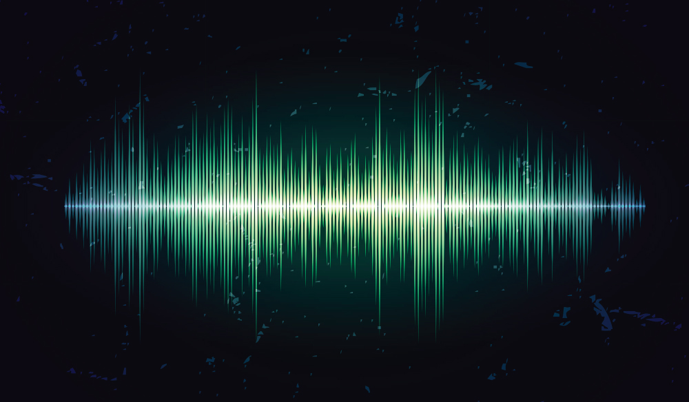

# Lab - Week 4, Session 1 - Multimedia

This lab introduces you to adding video and audio into your scenes.

[_How to Set Audio Levels for Video_](https://www.premiumbeat.com/blog/how-to-set-audio-levels-for-video/)

## Overview

Multimedia plays a rich role in immersing your users into your scenes. For instance, sound is pivotal in the real world, so it has a vital role for any 3D application or video game since it helps create tension and add emotion into the virtual spaces you create. To put it simply, the virtual worlds you make would be incomplete without appropriate video and sound effects.

Unity uses a video player component to attach video files to game objects, which it plays on the object's texture.

For sound, unity uses audio sources attached to game objects. An audio listener attached to another object (often the main camera) then picks up those sounds. Unity can create attenuated 3D sounds whose volume increases and decreases with distance.
