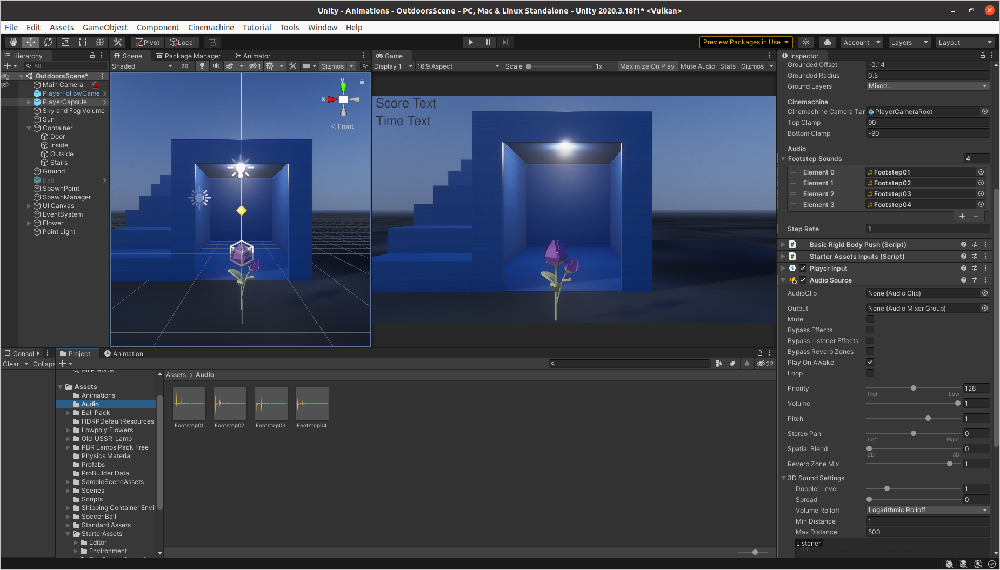
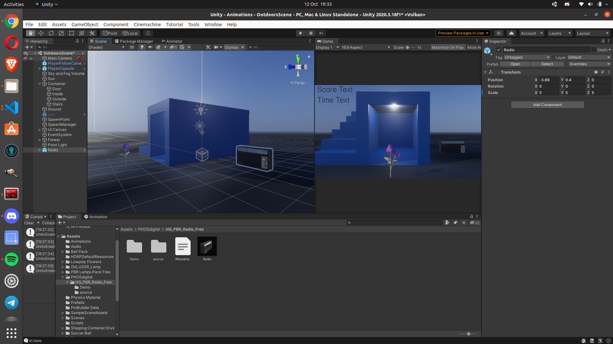
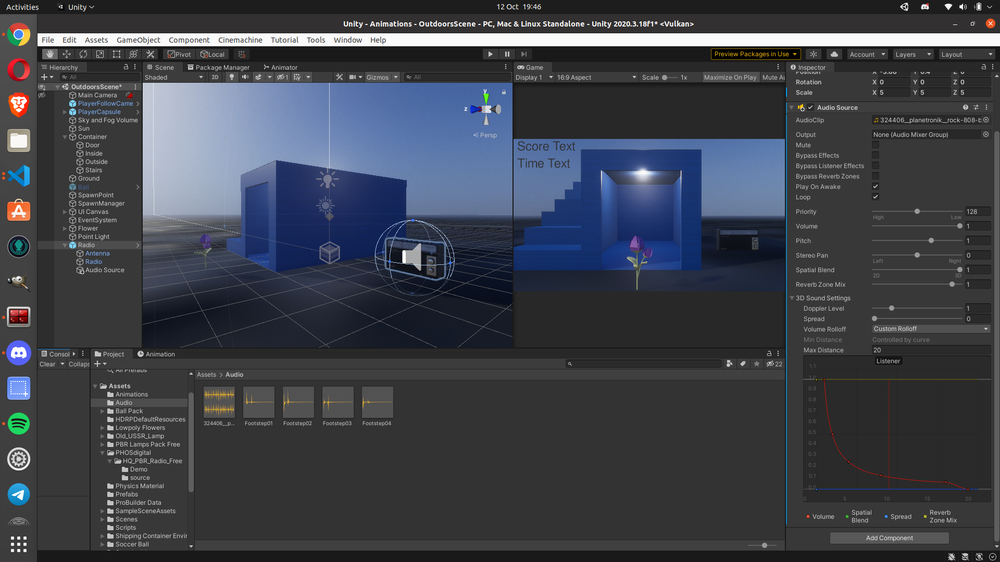

# Lab for Week 4, Session 2 - Audio in Unity

This lab serves as an introduction to Unity [audio](https://docs.unity3d.com/Manual/Audio.html).

## Overview

Sound plays an essential role in the real world, and so it also has a vital role for any 3D application or video game since it helps create tension, add emotion and immerse the user/player into the virtual space that you create for them. To put it simply, the virtual worlds you make would be incomplete without appropriate sound effects.

Unity uses _Audio Sources_, attached to _GameObjects_, to emit sound. An audio listener attached to another object (often the main camera) then picks up those sounds.

## Add Footsteps

Below, you are going to add some footsteps to the [First Person Character Controller](https://assetstore.unity.com/packages/essentials/starter-assets-first-person-character-controller-196525) (FPC) that you started using in an earlier lab.

### Adding Sound to the FPC

Open [Unity Hub](https://docs.unity3d.com/Manual/GettingStartedUnityHub.html), and open the project from the last lab.

Highlight the _PlayerCapsule_ in the _Hierarchy_, then find the script attached to the _First Person Controller_ in the _Inspector_, and open it.

First, you should add the private member variables that make the footsteps work:

```csharp
// Exposed audio variables
[Header("Audio")]
[Tooltip("An array of footstep sounds. One gets randonly selected to play")]
[SerializeField] private AudioClip[] footstepSounds;    
[Tooltip("Effects the gap between footstep sounds. Smaller number = smaller gap")]
[Min(1.0f)] [SerializeField] private float stepRate = 1.0f;

// Private audio variables
private float nextStep = 0.0f;
private AudioSource audioSource;
```

Next, in the script's `Start` method, you should assign the _AudioSource_ to its member variable:

```csharp
audioSource = GetComponent<AudioSource>();
```

Now, in the script's `Move` method, you should call the method you're going to use to play the footstep sounds.

```csharp
PlayFootStepAudio();
```

And now create the `PlayFootStepAudio` method:

```csharp
private void PlayFootStepAudio()
{
    // Debug.Log("Next " + nextStep);
    if (Grounded && _speed > 0.0f && Time.time > nextStep)
    {
        // Debug.Log("Time " + Time.time);
        float offset = _speed;
        if ( _speed >= stepRate ) {
            offset = (stepRate / _speed);
        } 
        nextStep = Time.time + offset;
        // pick & play a random footstep sound from the array,
        // excluding sound at index 0
        int n = Random.Range(1, footstepSounds.Length);
        audioSource.clip = footstepSounds[n];
        audioSource.PlayOneShot(audioSource.clip);
        // move picked sound to index 0 so it's not picked next time
        footstepSounds[n] = footstepSounds[0];
        footstepSounds[0] = audioSource.clip;
    }    
}
```

Before you can use the script in the game, you need to assign an _AudioSource_ to the _PlayerCapsule_ in the _Hierarchy_, and assign footstep audio clips to the `footstepSounds` array that you exposed to the _Inspector_. If you go the the [P3D GitHub repository](https://github.com/glowkeeper/P3D), you will find 4 footstep sound files in the directory _assets/audio_. Download those, then in the _Project_ tab, _Create_, _Folder_, call it _audio_, and put the downloaded footstep sounds in there. Now, in the _First Person Controller_ in the _Inspector_, set Footstep Sounds to 4, and then drag each of your footstep clips into each of the 4 available fields, as in Figure 1, below.



_Figure 1: Assigning the footstep audio clips_

Now press _Play_, and you should hear your FPC's footsteps.

There are two added exercises. First, make your footstep audio code more robust by only attempting to play sound if both an _AudioSource_ has been added to the _PlayCapsule_ and audio clips have been added to the `footstepSounds` array. Secondly, also add jump and landing sounds (you will find appropriate sound files on the [P3D GitHub repository](https://github.com/glowkeeper/P3D)).

## 3D Spatial Sound

Below, you will add a simple attenuated 3D sound to a radio so that its volume increases and decreases as your FPC gets closer or moves further away.

### Playing the Radio

First, you will need another asset, so go to the [Unity asset store](https://assetstore.unity.com/) and import [HQ PBR Old Retro Radio](https://assetstore.unity.com/packages/3d/props/hq-pbr-old-retro-radio-free-180303) (as always, ensure to update it to use the _HDRP_; so go to _Edit_, _Render Pipeline_, _HD Render Pipeline_, _Upgrade from Builtin Pipeline_, _Upgrade Project Materials..._).

The retro radio is listed as _PHOSdigital_ under the _Assets_ directory in the _Project_ directory; go there, open the _HQ PBR Radio Free_ directory, then drag the radio _Prefab_ into the hierarchy. Scale the radio by 5 across all axis and position it, so it is on the ground, next to the container, as in Figure 2.



_Figure 2: Positioning the radio_

You will also need the audio that the radio is going to play. Go to the [P3D GitHub repository](https://github.com/glowkeeper/P3D). You will find an _mp3_ that is a looped drum beat produced by the iconic [Roland TR-808](https://en.wikipedia.org/wiki/Roland_TR-808), a drum machine that has had a [huge influence on music](https://mixdownmag.com.au/features/columns/the-history-of-the-roland-tr-808-in-eight-iconic-tracks/). Add that _mp3_ to the _assets/audio_ directory you created above.

Now add an _AudioSource_ to the radio and drag the 808 _mp3_ into its _AudioClip_ field in the inspector. Ensure it is set to _Play on Awake_ and _Loop_. Press _Play_. You should hear the looped 808 track playing on the radio.

However, the 808 track maintains the same volume no matter the FPC's distance from the radio. You can do better. To do so, first, in the radio's _AudioSource_, set the _Spatial Blend_ field to _1_ - that enables the _AudioClip_ to take on 3D properties. Now, in the _3D Sound Settings_, set the Max Distance to 20, and at the 20 point on the x-axis of the graph, ensure the sound volume is set to zero, as in Figure 3.



_Figure 3: Radio 3D_

When you approach and walk away from the radio now, the volume should increase and decrease. Experiment with the 3D settings to see their effect.  

## Useful Links

+ [Unity Audio](https://docs.unity3d.com/Manual/Audio.html)
+ [Audio Overview](https://docs.unity3d.com/Manual/AudioOverview.html)
+ [freesound](https://freesound.org/)