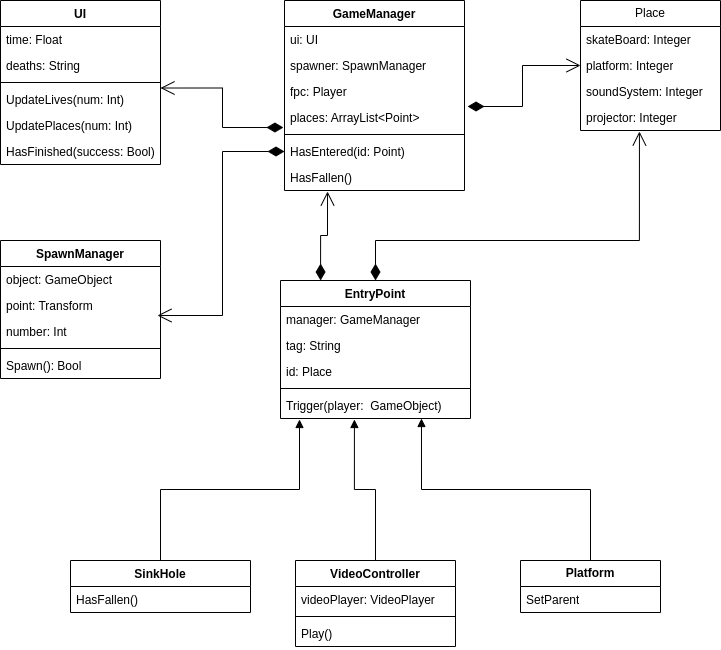

# Week 5, Session 1 - Scripting

The goal if this session is to get you to add some scripting capability to your scene.


_Scripting_

## Scripting

Scripts unlock a lot of the potential of the Unity engine because they enable you to perform actions such as create graphical effects, control physical gameplay behaviour or react to user input.

Below is the basic script created by Unity whenever you _Create_, _C# Script_. It demonstrates a couple of essential features.

```csharp
using System.Collections;
using System.Collections.Generic;
using UnityEngine;

public class NewBehaviourScript : MonoBehaviour
{

 // Start is called before the first frame update
    void Start()
 {

 }

 // Update is called once per frame
    void Update()
 {

 }
}
```

[C#](https://docs.microsoft.com/en-us/dotnet/csharp/) is an object-oriented language featuring classes that you instantiate as objects (as and when required). The class _NewBehaviourScript_, above, inherits from Unity's [MonoBehaviour](https://docs.unity3d.com/ScriptReference/MonoBehaviour.html), which is a base class from which every Unity script inherits its functionality. _NewBehaviourScript_ overrides the _MonoBehaviour_ methods _Start_ and _Update_ - _Start_ is called when the object is first created (and before the first frame), and _Update_ is called once every frame render.

_MonoBehaviour_ defines other behaviour, too - the one you will likely see most frequently is _FixedUpdate_, which Unity's physics system calls at a rate independent from the main thread's (rendering) frame rate. For example, imagine the physics engine is running at fifty calls per second, and the frame rate is running at twenty-five frames per second (FPS) - then _FixedUpdate_ will be called twice per frame. For that reason, it is bad practice to put physics calculations in _Update_ - they should go in _FixedUpdate_, instead (similarly, user input should go in _Update_, and not _FixedUpdate_.) Figure 1, below, shows a flowchart for MonoBehaviour.


_Figure 1: MonoBehaviour Flow Chart_

Unity defaults to a _Time_ _Fixed Timestep_ of 0.02, which translates to _FixedUpdate_ getting called fifty times a second, and a _VFX_ _Fixed Timestep_ of 0.001666667, which translates to 60 FPS.

## Design Patterns

You can write some very simple scripts and still do interesting things in Unity (so don't worry if you do not have much/any programming experience). For example, here's a simple script that spawns objects into a scene: 

```csharp
using System.Collections;
using System.Collections.Generic;
using UnityEngine;

public class SpawnObjects : MonoBehaviour
{
 [SerializeField] private GameObject mObject;
 [SerializeField] private Transform spawnPoint;
 [SerializeField] private int maxObjects;

    private int numObjects;

 // Start is called before the first frame update
    void Start()
 {
       
 }

 // Update is called once per frame
    void Update()
 {
        if (numObjects < maxObjects)
 {
            SpawnObject(numObjects);
            numObjects++;
 }  

 }

    void SpawnObject(int num)
 {
        GameObject mObjectClone = Instantiate(mObject, spawnPoint.position, Quaternion.identity) as GameObject;
        mObjectClone.SetActive(true);
 }
}
```
Drag the script onto a GameObject and call that object _SpawnManager_. Next,  create a Cube GameObject and drag that into the script's _M Object_ field. Finally, add an empty GameObject _Spawn Point_  into the scene and add that to the script's _Spawn Point_ field. Set the _Max Objects_ field to 10. Press _Play_ - you should have ten more cubes at the _Spawn Point_ - congratulations! You have created a scripted scene!

However, to explore the full power of Unity's scripting, you will probably have to write something more extensive,  requiring some planning and design. The _Gang of Four_'s classic programming book, [Design Patterns: Elements of Reusable Object-Oriented Software by Erich Gamma, Richard Helm, Ralph Johnson, and John Vlissides](https://www.oreilly.com/library/view/design-patterns-elements/0201633612/) describes various ways of organising software systems. The themes of that book form the basis of the site [Game Programming Patterns](https://gameprogrammingpatterns.com/introduction.html), which was created by Bob Nystrom, a former employee at [Electronic Arts](https://www.ea.com/), the company responsible for many popular games, including  [EA Sports FC (FiFa)](https://www.ea.com/en-gb/games/ea-sports-fc) and [The Sims](https://www.ea.com/games/the-sims/the-sims-4). 

Game Programming Patterns describes six patterns that a programmer might apply to a game:

1. Command
2. Flyweight
3. Observer
4. Prototype
5. Singleton
6. State

Below is a brief discussion of one or two of those patterns, but if you want to enter the game's world as a programmer, you should visit Bob Nystrom's site and have a read for yourself. 

## Singleton

The _Singleton_ pattern is pervasive in the game's world (and beyond) - it's common to see various all-powerful single _Manager_ classes that govern the behaviour of various parts of a game (Bob Nystrom's site has an interesting discussion on whether that is a good thing or not).

Below is a [class design](https://www.visual-paradigm.com/guide/uml-unified-modeling-language/uml-class-diagram-tutorial/)  that shows examples of object-oriented composition and inheritance. The _GameManager_ is a Singleton that _has-a UI_, _has-a SpawnManager_ (which might also be a Singleton), _has-a  Player_ and _has-a list of Places_. Addititionally, _SinkHole_ _is-a EntryPoint_, as are _VideoController_ and _Platform_.



## Observer

The Observer pattern is an event-driven _Model-View-Controller_ (MVC) architecture that's as pervasive (if not more so) as the Singleton pattern. It lets one piece of code announce an event without caring who receives that event or what actions they take. That leads to software designs featuring [low coupling and high cohesion](https://www.geeksforgeeks.org/software-engineering-coupling-and-cohesion/), which, in general, is considered a good thing. 

### Scriptable Objects as Observers

Unity's [Scriptable Objects](https://docs.unity3d.com/Manual/class-ScriptableObject.html) allows you to create and edit GameObjects independently of scenes - they're super-useful for preserving data across levels or subscribing behaviour to different instances of similar objects. 

To use a ScriptableObject, create a script and make it inherit from the ScriptableObject class. You can also use the ```CreateAssetMenu``` attribute to make it easy to create custom assets using your ScriptableObject class.

```csharp
using UnityEngine;

[CreateAssetMenu(fileName = "Data", menuName = "ScriptableObjects/SpawnManagerScriptableObject", order = 1)]
public class SpawnManagerScriptableObject : ScriptableObject
{
    public string prefabName;

    public int numberOfPrefabsToCreate;
    public Vector3[] spawnPoints;
}
```

With the above script in your Assets folder, you can create an instance of your ScriptableObject by navigating to Assets > Create > ScriptableObjects > SpawnManagerScriptableObject. Give your new ScriptableObject instance a meaningful name and alter the values. To use these values, you need to create a new script that references your ScriptableObject, in this case, a SpawnManagerScriptableObject:

```csharp
using UnityEngine;

public class Spawner : MonoBehaviour
{
    // The GameObject to instantiate.
    public GameObject entityToSpawn;

    // An instance of the ScriptableObject defined above.
    public SpawnManagerScriptableObject spawnManagerValues;

    // This will be appended to the name of the created entities and increment when each is created.
    int instanceNumber = 1;

    void Start()
 {
        SpawnEntities();
 }

    void SpawnEntities()
 {
        int currentSpawnPointIndex = 0;

        for (int i = 0; i < spawnManagerValues.numberOfPrefabsToCreate; i++)
 {
            // Creates an instance of the prefab at the current spawn point.
            GameObject currentEntity = Instantiate(entityToSpawn, spawnManagerValues.spawnPoints[currentSpawnPointIndex], Quaternion.identity);

            // Sets the name of the instantiated entity to be the string defined in the ScriptableObject and then appends it with a unique number. 
            currentEntity.name = spawnManagerValues.prefabName + instanceNumber;

            // Moves to the next spawn point index. If it goes out of range, it wraps back to the start.
            currentSpawnPointIndex = (currentSpawnPointIndex + 1) % spawnManagerValues.spawnPoints.Length;

            instanceNumber++;
 }
 }
}
```

Attach the above script to a GameObject in a Scene, and in the Inspector, set the Spawn Manager Values field to the new SpawnManagerScriptableObject. Set the Entity To Spawn field to any Prefab in your Assets folder, then click Play in the Editor. The Prefab you referenced in the Spawner instantiates using the values you set in the SpawnManagerScriptableObject instance.

However, [ScriptableObjects can do many more things](https://unity.com/blog/engine-platform/6-ways-scriptableobjects-can-benefit-your-team-and-your-code), including implementing the Observer pattern by managing in-game interactions through Events and event channels.

## Exercise

Add some scripting to your scene, perhaps by using a script to spawn some [prefab](https://docs.unity3d.com/Manual/Prefabs.html) particular to your game (however, you may have other ideas as to how scripting could enhance your project).

## Links

- [Scripting](https://docs.unity3d.com/Manual/ScriptingSection.html)
- [C#](https://docs.microsoft.com/en-us/dotnet/csharp/) 
- [MonoBehaviour](https://docs.unity3d.com/ScriptReference/MonoBehaviour.html)
- [Game Programming Patterns](https://gameprogrammingpatterns.com/introduction.html)
- [Object-Oriented Class Design](https://www.visual-paradigm.com/guide/uml-unified-modeling-language/uml-class-diagram-tutorial/)  
- [Scriptable Objects](https://docs.unity3d.com/Manual/class-ScriptableObject.html)
- [6 ways ScriptableObjects can benefit your team and your code](https://unity.com/blog/engine-platform/6-ways-scriptableobjects-can-benefit-your-team-and-your-code)
