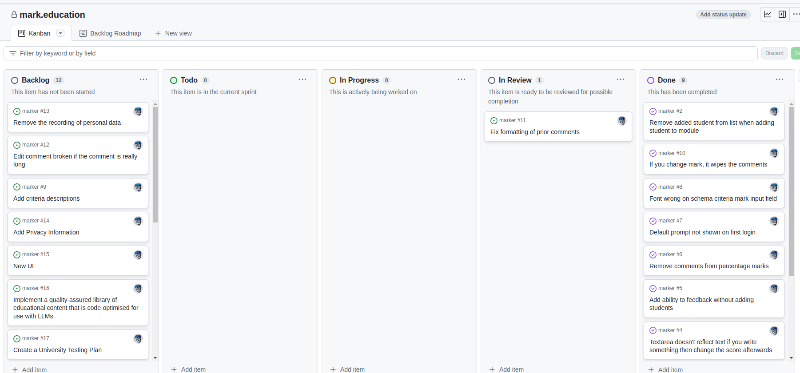

# Lab for Week 5, Session 2 - Version Control and Project Planning

This lab sets up version control for your coursework. It also creates a project plan you'll use to help develop that coursework.

## Overview

[GitHub](https://github.com/)  is a cloud-based [version control](https://www.atlassian.com/git/tutorials/what-is-version-control) service with [git](https://git-scm.com/) at its core. Version control systems are the means by which developers store, track changes and manage their code over time. They feature mechanisms such as [branching](https://www.atlassian.com/git/tutorials/using-branches) and [merging](https://www.atlassian.com/git/tutorials/using-branches/git-merge), giving developers even more control over the software they build. Branches are a snapshot of any changes made to a codebase, so when a developer wants to add a new feature or fix a bug, they create a new branch that captures the changes. Merging is the way version control systems reunite two branches.

_Figure 1: A visualisation of git branching and merging_

[Agile project management](https://www.atlassian.com/agile/project-management) is a planning method often used to build and maintain software. A full agile project will feature [epics](https://www.atlassian.com/agile/project-management/epics) and [ceremonies](https://www.atlassian.com/agile/scrum/ceremonies) like [standups](https://www.atlassian.com/agile/scrum/standups), [sprint planning](https://www.atlassian.com/agile/scrum/sprint-planning), [sprint reviews](https://www.atlassian.com/agile/scrum/sprint-reviews) (to get stakeholder feedback) and [retrospectives](https://www.atlassian.com/agile/scrum/retrospectives). [Kanban](https://www.atlassian.com/agile/kanban) boards are a means by which agile software teams can use a process of continuous development, through cards and columns, to help visualise the work that needs to be done.

## GitHub

Below, you will setup the repository you will use to help manage the Unity scene you create for your coursework.

### Setup the Repository

1. Open a browser and go to your GitHub account. From the **Repositories** tab, click on _New_ and name your project howsoever you choose. Make the repo' private (you can make it public if and when you do a stunning piece of work that you wish to add to your portfolio and showcase to potential employers), select _Add a README file_, then _Create repository_
2. Visit _Settings_, _Collaborators_, and add _glowkeeper_ - this step means that the Module Convenor can access your coursework for marking purposes
3. _Clone_ your coursework repository to your local harddrive
4. Also _Fork_ and _Clone_ the [main P3D repository](https://github.com/glowkeeper/Programmingfor3D) to your harddrive
5. Create a _New Project_ in Unity, and store it in a directory in your local copy of the coursework repository. This could be any directory, but a good choice might be _src/yourProjectName_.
6. Copy _src/unity/.gitignore_ from your local copy of the [main P3D repository](https://github.com/glowkeeper/Programmingfor3D) to the directory containing the Unity project you created above
7. Now [add](https://github.com/git-guides/git-add), [commit](https://github.com/git-guides/git-commit) and [push](https://github.com/git-guides/git-push) the changes in your local repository up to GitHub (note - you should only have tens of files to push up to GitHub, not thousands - if you have thousands, you have not put the _.gitignore_ file in the correct place)

## Project Board

Now you will set up the Kanban board that you will use to manage the development of your coursework.

### Kanban

1. Open a browser and go to your GitHub account. From the **Projects** tab, click on _New project_. Select _Board_, and _Create_. Name it howsoever you choose
2. Create two new columns, 1. _Backlog_, and 2. _In Review_ and order them as in Figure 2, below

_Figure 2: Kanban board_

3. Now you can add items (such as _Write Introduction_) to the backlog
4. When you decide (with your Project Manager- the Module Convenor) that you plan on working on the item in the current sprint, you will move that item into the _ToDo_ column. Once you start working on the item, it moves into the _In Progress_ column. Once you feel it's done, move it into the _In Review_ colum - you will review that item in the weekly sprint review that you have with your Project Manager; if they agree the item is done, it will move into the _Done_ column; otherwise, it will move back into the _Todo_ column. In that sprint review meeting you will also decide on the items that you will work on during the next sprint. This process will continue week-by-week until you have completed your (excellent) coursework

## Useful Links

- [git](https://git-scm.com/)
- [Using Git with Visual Studio Code (Official Beginner Tutorial)](https://www.youtube.com/watch?v=i_23KUAEtUM)
- [What is GitHub?](https://kinsta.com/knowledgebase/what-is-github/)
- [What is Version Control?](https://www.atlassian.com/git/tutorials/what-is-version-control)
- [git add](https://github.com/git-guides/git-add)
- [git commit](https://github.com/git-guides/git-commit)
- [git push](https://github.com/git-guides/git-push)
- [Agile project management](https://www.atlassian.com/agile/project-management)
- [Epics](https://www.atlassian.com/agile/project-management/epics)
- [Ceremonies](https://www.atlassian.com/agile/scrum/ceremonies)
- [Standups](https://www.atlassian.com/agile/scrum/standups)
- [Sprint planning](https://www.atlassian.com/agile/scrum/sprint-planning)
- [Sprint reviews](https://www.atlassian.com/agile/scrum/sprint-reviews)
- [Retrospectives](https://www.atlassian.com/agile/scrum/retrospectives)
- [Kanban](https://www.atlassian.com/agile/kanban)

