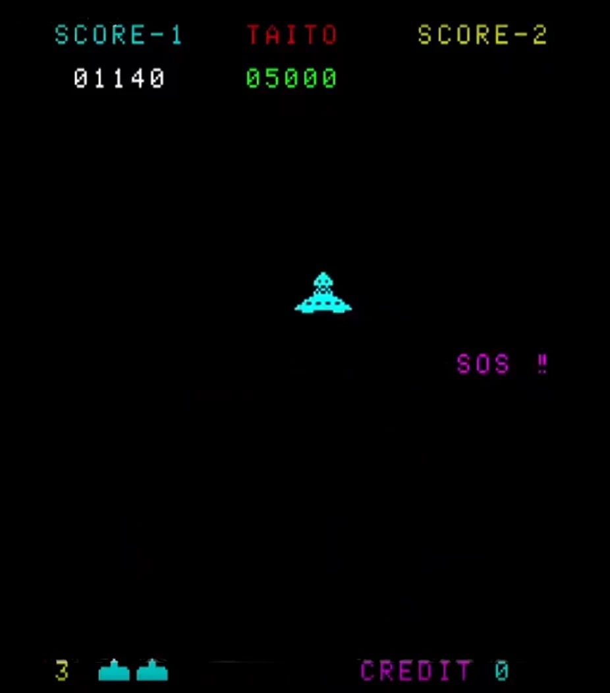

# Week 6, Session 2 - Cutscenes

The goal of this session is to have you implement a cut scene in your project.

## Cutscenes

A cutscene is a non-interactive sequence during a game. Cutscenes serve many and varied purposes; they might show conversations between characters, set the tone and create emotional connections, reward the player, introduce gameplay elements, show the effects of a player's actions, improve pacing or foreshadow the future. Consequently, they are an integral part of many games.

The most common cutscene form uses in-game graphics and animated sequences. However, cutscenes might also use pre-rendered graphics streamed from a video file (so-called full motion videos (FMV)), plain text or audio to create some in-game dialogue that introduces the next scene (e.g. the opening scene of any Star Wars film), or even comic-book effects in the form of a series of images or as plain text and audio.

Cutscenes have a long history in computer games. The Sumerian Game is an early mainframe game from 1966 that introduced its gameplay setting using a slideshow and audio. Space Invaders, in 1979, introduced a comic-book-style intermission between levels. 1981's Donkey Kong was the first to use a cutscene that helped advance its storyline. 1983's Bega's Battle introduced animated FMV cutscenes with voice acting. And circa 1983, the games Bugaboo (The Flea) and Karateka helped take the cutscene concept out of the arcade and onto early home computers, such as the ZX Spectrum. Today, cutscenes are ubiquitous.

## Exercise

Create a cutscene in your game. Perhaps show the scene you've created or introduce some storyline using text (much like Star Wars).

## Links

+ [Cutscenes and Trailers with Timeline and Cinemachine](https://learn.unity.com/project/cutscenes-and-trailers-with-timeline-and-cinemachine)
+ [Introduction to Timeline](https://learn.unity.com/tutorial/introduction-to-timeline-2019-3)