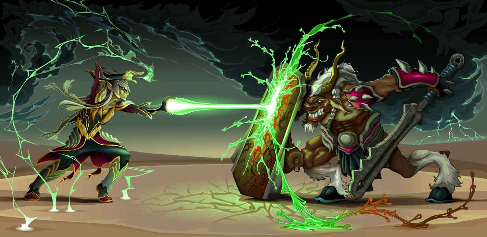

# Week 7, Session 1 - AI in Games

This session aims to introduce you to the use of AI in games. 

Games use AI in many ways. AI can help create intelligent characters, perform procedural generation of levels, achieve game player modelling, perform texture upscaling, conduct cheat detection, and do natural language processing (NLP) for text-to-speech applications. And more besides. Below is a discussion of such uses.

## AI

Since its inception in the 1950s, AI has been delineated into two schools: 
Symbolic AI, whereby an algorithm searches through a series of states to solve a specific problem
Machine Learning, whereby a solution is sought by searching through existing data about a given problem. The system _learns_ the optimal solution through subsequent iterative passes through the data.  
Machine learning has subsequently evolved into two distinct disciplines:
Deep Learning, which is the training of AI engines using large-scale neural networks so that an optimal solution is inferred. 
Generative AI. That is similar to deep learning, except solutions are generated rather than inferred.
Deep Learning creates AIs capable of expert-level game-play in games such as chess and Go. Generative AI creates assets such as audio, text and art in many forms. 

## Application of AI in Games

Recently, Generative AI has begun to get used in the production of games, perhaps by helping with testing and quality assurance or by creating art or code assets. However, legal obstacles are preventing its wide-scale adoption there - the consensus is that producing assets in-house is safer than using Generative AI. Hence, the most common use of AI is to enhance the in-game player experience, and the focus here is on that latter use.

There are three major applications of AI in games:
AI that plays as part of typical game-play
AI that creates in-game content
AI that models properties of games
Game AI is a subset of Symbolic AI. Game AI is much more predominant than machine learning in the first use, typical game-play, and it is used in many ways. It creates the behaviour of non-playing characters (NPCs). It produces navigation meshes that calculate (and delineate) where a character (or enemy) may move. Algorithms such as finite state machines or behaviour trees encapsulate the behaviours a player (or enemy) may execute or the conditions under which certain behaviours become apparent. Utility AI systems determine the best action to take in certain situations. Bark AI Systems will create the rules under which audio gets communicated to the player. The list goes on and on!

For the second use of generating in-game content, there are Generative AI systems that perform pseudo-random procedural content generation using heuristics and applied rules and processes, and Deep Learning Super-Sampling (DLSS) systems that perform real-time rendering to improve the overall graphical quality of the game by upscaling images on a GPU. 

Finally, for modelling users, deep-learning AI systems are used for player matchmaking in some multiplayer online battle arena games.

## Exercise

Introduce some 'enemies' into your scene!

## Links

[How is AI Used in Video Games](https://youtu.be/j3LW5no-5Ao?feature=shared)
