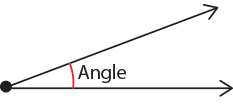
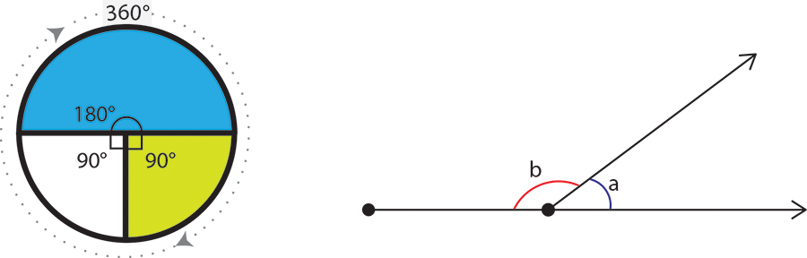
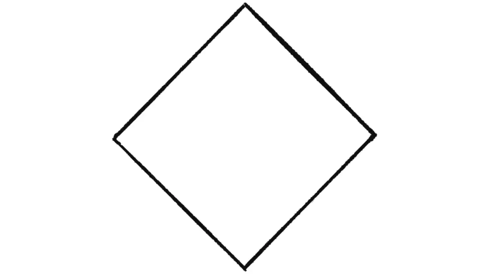
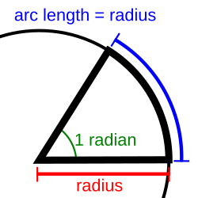
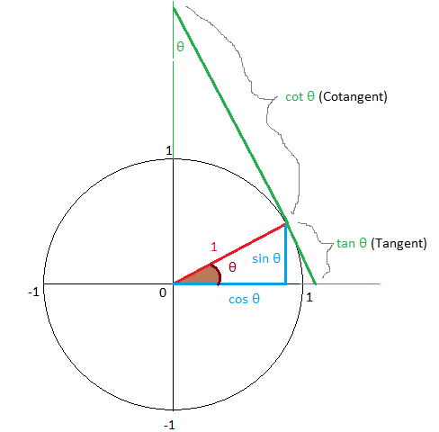
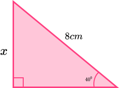
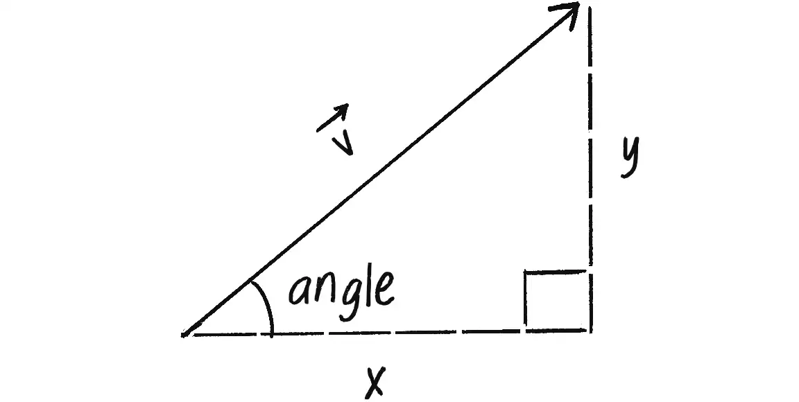
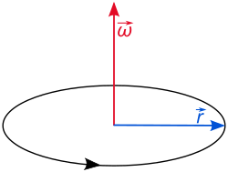
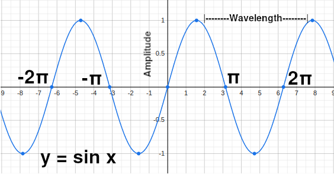

# Trigonometry

Trigonometry is the mathematics of triangles. It forms the mathematical basis of many behaviours of objects, including the description of shapes, motion, angular velocity, rotations and transformations; hence, a basic understanding of trigonometry is essential if you want to work with circles, arcs, or lines and figure out the relationship between objects in a 3D space, perhaps calculating the distances between them. At the heart of trigonometry are angles.

## Angles

An angle (θ - the Greek symbol theta) is formed by the space between two intersecting lines that join at a point.

A unit of measurement of angles is _degrees_. The amount of degrees formed by an angle describes circularity, or rotation, about the point of origin.

A full rotation is 360°. A half-circle is 180°. A quarter-circle, or right angle, is 90°. Below is a square rotated 45°, using its centre as its pivot point.

Radians are another unit of trigonometric measurement. They are defined by the ratio of the length of the arc of a circle (a segment of the circle's circumference) to the radius of that circle. One radian is the length at which that ratio equals 1.

Radians have a strong relationship to Pi (π), which is an irrational number defined as the ratio of a circle's circumference (the distance around the outside of the circle) to its diameter (a straight line that passes through the circle's centre). A full circle (360°) is equivalent to 2π radians. Hence, 180° is π radians, and 90° is π/2 radians. The formula to convert from degrees to radians is as follows:

radians = (2π x degrees) / 360

Although to many (at least in the UK), radians may not be as familiar as degrees, they are often useful as they relate angle to length, making some calculations much more straightforward. For example, to find the speed of a vehicle in metres per second, you can multiply the radius of one of its wheels by the number of radians it turns per second. So if the wheel has a radius of two metres and turns at six radians per second, the speed is 12 metres per second. Additionally, their association with Pi (π) makes radians a somewhat more intuitive unit for graphing, performing calculus and modelling some spherical geometry.

## Trigonometric Functions

Trigonometry is based on the unit circle, a circle with the centre at the origin (0,0 in a 2D space and 0,0,0 in 3D) with a radius equal to 1.

Since any triangle can be split into right-angled triangles whose opposite and adjacent sides form the axis of a graph, we can then use the functions found in trigonometry to understand ratios, symmetry, transformations, rotations and much more besides.

The three main trigonometric functions are Sine, Cosine and Tangent. They are used to find an unknown side or angle of a triangle when two pieces of information are known (such as the length of two sides or the length of one side and an angle). Sine, Cosine and Tangent are described by the mnemonic **SohCahToa** - take one of the non-right angles in the triangle - the adjacent side is the one touching that angle, the opposite side is the one not touching that angle, and the hypotenuse is the side opposite the right angle.

- **Soh**: sine(θ) = opposite/hypotenuse. Used when the opposite side and the hypotenuse are known
- **Cah**: cosine(θ) = adjacent/hypotenuse. Used when the adjacent side and the hypotenuse are known
- **Toa**: tangent(θ) = opposite/adjacent. Used when the opposite side and adjacent sides are known

For example, given the right-angled triangle below, how can we work out the length of the side labelled _x_?

Since _x_ is opposite the hypotenuse, we need the Sine function, and we have:

sin(40) = x/8, giving:

8 * sin(40°) = _x_. Plugging sin(40°) into a calculator, we get ~0.6428, so:

8 * 0.6428 = 5.1424.

So the length of _x_ is ~5.1424. Similarly, we could work out the remaining side's length. That is left as an exercise.

Sometimes, it is the angle that is unknown. In such situations, the inverse functions are useful - we have the inverse tangent (or arctangent (arctan or atan)), the inverse sine (or arcsine (arcsin or asin)) and inverse cosine (or arccos (arccos or acos)).

Using the example above, we have:

sin(θ) = ~5.1424 / 8 = ~0.6428, so:

θ = arcsin(0.64278760968) = 40°, as expected.

## Vectors and Trigonometry

The following describes a right-angled triangle in terms of a vector, v.

The vector, v is the hypotenuse, and the components of the vector (x and y) are the opposite and adjacent sides of the triangle. Hence, the angle is another way to specify the vector's direction because you move x steps right and y steps up. Therefore, the trigonometric functions establish a relationship between the components of a vector and its direction and magnitude.

## Rotation

Rotation, or angular motion, is a movement about an angle with respect to time, and just as linear motion uses velocity to show the rate at which an object's position changes over time, angular motion uses angular velocity to show the rate at which an object's angle changes over time. By extension, angular acceleration describes changes in an object's angular velocity.

For linear motion, we have acceleration -> velocity -> position:

velocity = velocity + acceleration, and
position = position + velocity

Similarly, for angular motion, we have:

angular velocity = angular velocity + angular acceloration
angle = angle + angular velocity

Angular velocity is a three-dimensional vector ω (the lowercase Greek letter omega). It has a direction along the axis of rotation and a magnitude equal to the radians spun by the body per unit of time.

So, given the position vector r of a moving body in three-dimensional space, its angular velocity is a vector whose magnitude is the rate at which r rotates about an angle and whose direction is perpendicular to the plane in which r rotates about an angle at velocity v. However, as there are two directions perpendicular to any plane, the convention is that the unit vector ω is perpendicular to the plane spanned by r and v so that the right-hand rule is satisfied and the instantaneous direction of angular displacement is counter-clockwise when looking down on ω:

Using the cross product, we have:

ω = r x v

Negating the angular velocity is equivalent to changing the direction of rotation about the axis.

## Simple Harmonic Motion

Below is the graph of the sine wave _y = sin x_. The graph shows the relationship of the sine wave to the radians discussed above, where 2π radians represent a circle or a complete revolution of the sine cycle.

The sine wave exhibits simple harmonic motion, a periodic oscillation between points on the graph. Anything cyclic demonstrates examples of oscillating motion that can be modelled using the sine function. The different notes or chords played on the guitar are examples of such harmonics because the guitar generates sinusoidal sound waves.

Simple harmonic motion is expressed as a function of time, with the following properties elements:

1. Amplitude is the height on the y-axis the sine wave reaches from the x-axis
2. Period is the seconds per (2π) cycle.
3. Frequency is related to period as it represents the number of cycles per second
4. Wavelength is inversely proportional to the frequency of the sine wave as waves with higher frequencies have shorter wavelengths and lower frequencies have longer wavelengths

On guitar, the greater the amplitude, the louder the sound waves. And middle A has a frequency of 440 hertz (cycles per second).

Simple harmonic motion can be graphed in a number of ways, including using a slowly incrementing value of angular velocity as the input to the sine function so that the object's motion oscillates smoothly every time the value of angular velocity goes beyond a multiple of 2π and completes a cycle (whereby _period = 2π / angular velocity_).