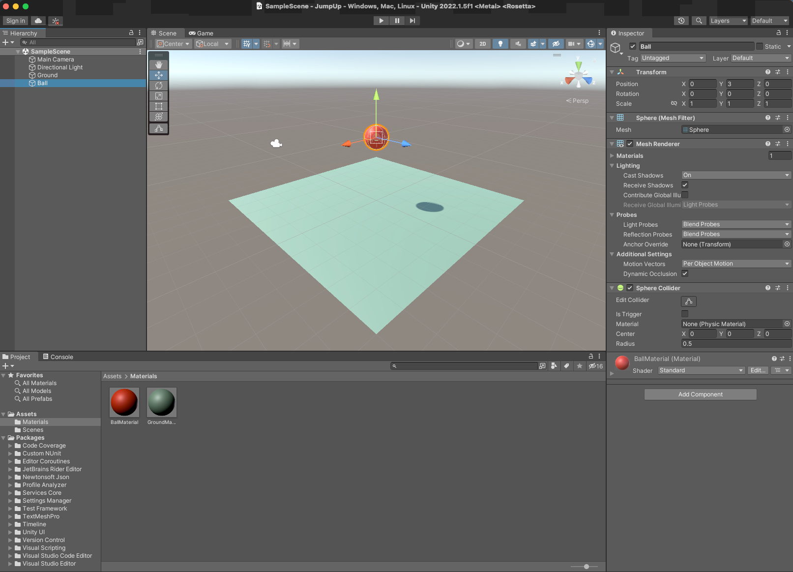
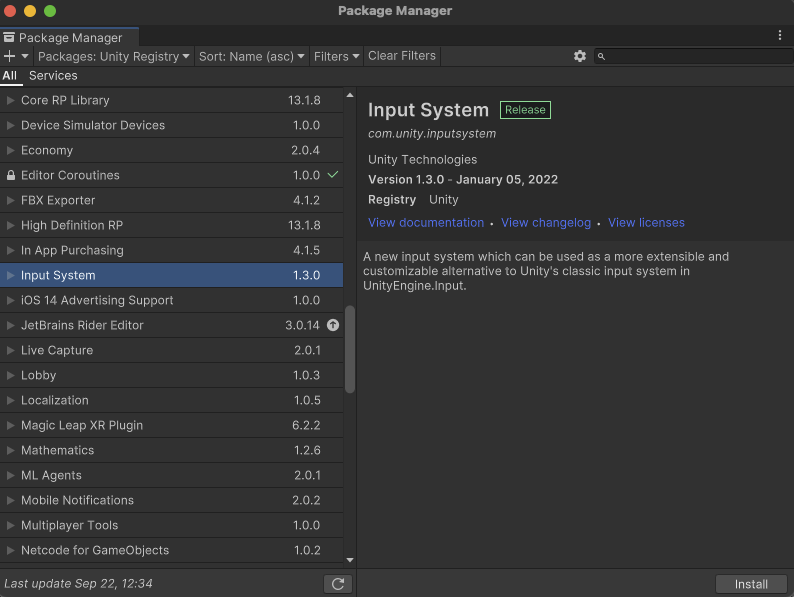
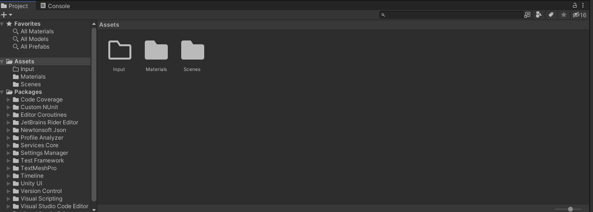
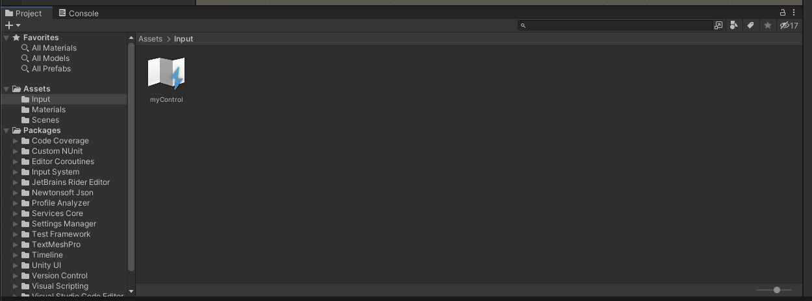
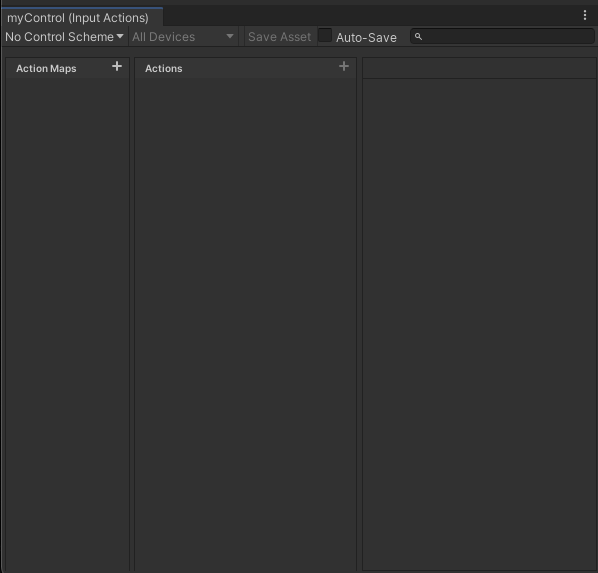
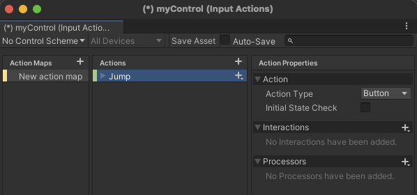
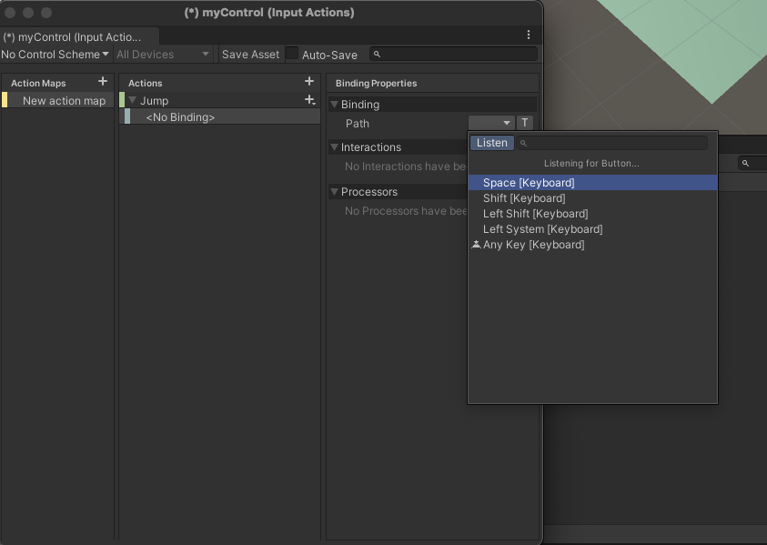
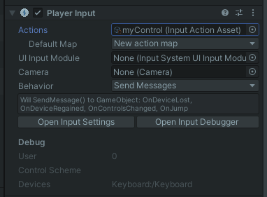
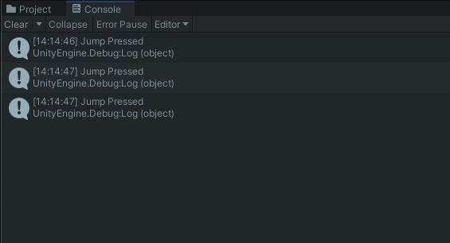
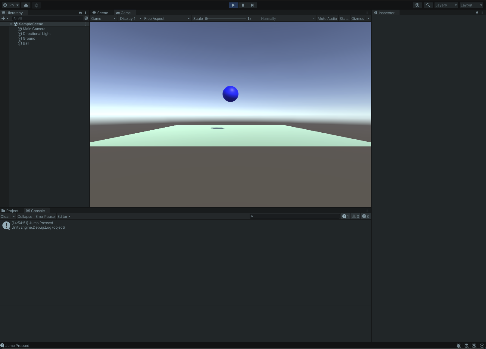

# Unity 3D Fundamentals

Create a new project called "JumpUp". Add a plane and call it "ground" and add a sphere and call it "ball".



Add a _RigidBody_ to your ball. When you press play the ball should drop on to the ground and stop.

Now we will use the Unity Input System to make the ball do something. Click menu: Window > Package Manager then Select "Packages: Unity Registry" and then "Input System" package from the list. Click Install (top right) and then "Yes" on the warning message. Your Unity project will close and restart.



Create an empty folder in your Assets folder and call it "Input".



By default the icon is an outline as the folder is currently empty. Double click the folder and then use the Project create Menu to create an "Input Actions" and call this myControl.



Double click on the myControl icon to open the input actions dialog.



Click on the + next to Action Maps to create a new map and then rename the Action to "Jump".



This is the Jump action, but we need to assign it to some kind of control input action - let's use the spacebar. Click on the small down arrow next to the + sign for Jump and select "add binding". Then click on the triangle to the right of Path and select "Keyboard".


If you now click on the "Listen" button Unity will listen for an input. Hit the space bar.



Click on "Space [Keyboard]" and then save the asset by clicking the "Save Asset" tab (above where you have named the action Jump in the window).

That is the input system set up, we now need to add it to the ball. Select the ball in the Hierarchy so that it appears in the inspector window and "add component". Select "Input" then "PlayerInput". Now drag the myControl action asset on to the Actions box in the Player Input component. 



We now need to create a script to do something.  Before creating a script launch VisualStudio from the software hub on the desktop.  

Now go back to Unity and create a new script using the add component button on the Ball object and call it "myBall". Open the script by double clicking on the script in the assets folder and selecting to launch it in VisualStudio.  

Add the Input System by adding the following line at the top of your script: 

`using UnityEngine.InputSystem;`

By default you have already created a method that is called when we hit the space bar called OnJump(). You associated this method with the Jump action by using this pattern to name it: 

`public void On[Action Name Goes Here]().`

For example, the Jump Action invokes `OnJump()`, while the Attack action invokes `OnAttack()`.

Add the following method below your Update method:

```csharp
void OnJump() 
{ 
    Debug.Log("Jump Pressed"); 
         
} 
```

We have added the Debug command here to check if the Jump action is working. This outputs the words "Jump Pressed" to the Console window. 

Save the script and run the project. When you push the space bar you should get the following in the Console window:



Ultimately we are going to get the ball to jump, but let's do something simpler first. Below the Debug line add the code: 

`GetComponent<Renderer>().material.color = Color.blue;`

Save the script and play. This line assigns the colour blue to the _GameObject_ to which the script is attached. So your ball should turn blue. 

OK so now we need to make the ball actually jump. In the [Unity 1 - Player control](https://learn.unity.com/project/unit-1-driving-simulation?missionId=5f71fe63edbc2a00200e9de0&pathwayId=5f7e17e1edbc2a5ec21a20af&contentId=5f7229b2edbc2a001f834db7) tutorial, a `transform.Translate` and `transform.Rotate` wer used to move the _GameObject_. This is straightforward, but not always ideal - instead, you should use _forces_. In Unity, you apply forces to a _RigidBody_. We already have a _RigidBody_ added to our ball, so let's add a reference to that in the script. Add the following line after the opening { for the myBall class. 

`private Rigidbody rb;`

Now we need to assign the rb variable. In the Start() method add the following: 

`rb = GetComponent<Rigidbody>();`

_rb_ is now associated with the _RigidBody_ of the ball GameObject. We can now apply a force to it to get it to move. Add the following code to your OnJump() method: 

`rb.AddForce(0.0f, 300.0f, 0.0f);`

`AddForce` applies a force continuously along the direction of the force [vector](./vectors.md). In this case it is a vector3 with x,y,z vector values. Y is the up direction in our scene so that has the value 300 with the x and z vectors zero. Your script should look like this:

```csharp
using System.Collections; 
using System.Collections.Generic; 
using UnityEngine; 
using UnityEngine.InputSystem; 

public class myBall : MonoBehaviour 
{ 
    private Rigidbody rb; 

    // Start is called before the first frame update 
    void Start() 
    { 
        rb = GetComponent<Rigidbody>(); 
    } 

    // Update is called once per frame 
    void Update() 
    { 
         
    } 
    void OnJump() 
    { 
        Debug.Log("Jump Pressed"); 
        GetComponent<Renderer>().material.color = Color.blue; 
        rb.AddForce(0.0f, 300.0f, 0.0f); 

    } 
}
```

Save the script and then play the scene and the ball should turn blue and jump when you press the space bar. 



What we have done here is very simple, but hopefully you get the idea of applying a force to a _RigidBody_ to move it. You can play around with the Z value, but it is never ideal to hard code values like this and you will notice if you repeatedly hit the spacebar the ball carries on going up. Also we would want to do something with the x and y values in a real game.  

The [Unity Roll-a-ball tutorial](https://learn.unity.com/tutorial/setting-up-the-game?uv=2020.2&projectId=5f158f1bedbc2a0020e51f0d) is a nice introduction in how to move rigidbodies in a simple game.  Create a 3D Core project and call it  "Rollaball" like you did with "JumpUp" above and save it in your GameDev folder. Now follow the Roll-a-Ball tutorial.
