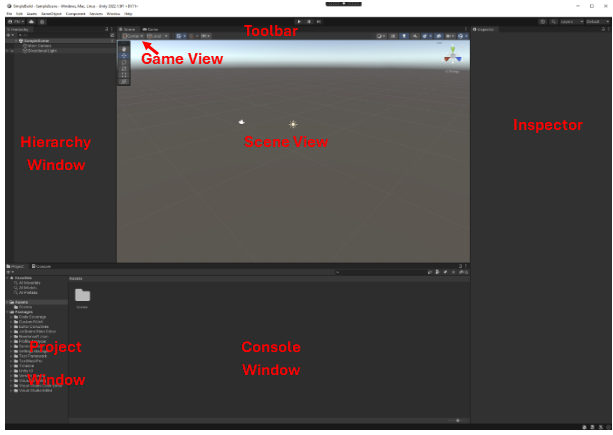
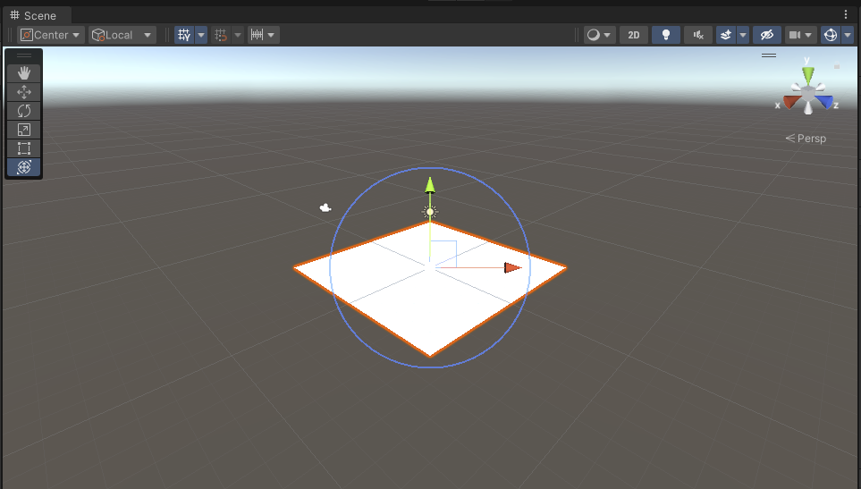
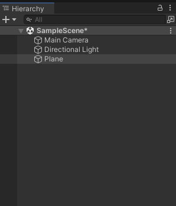
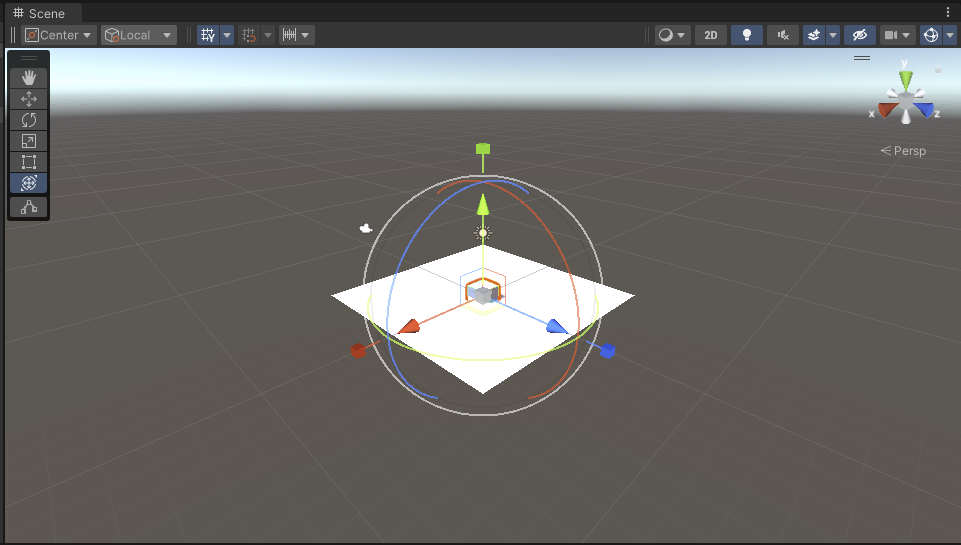
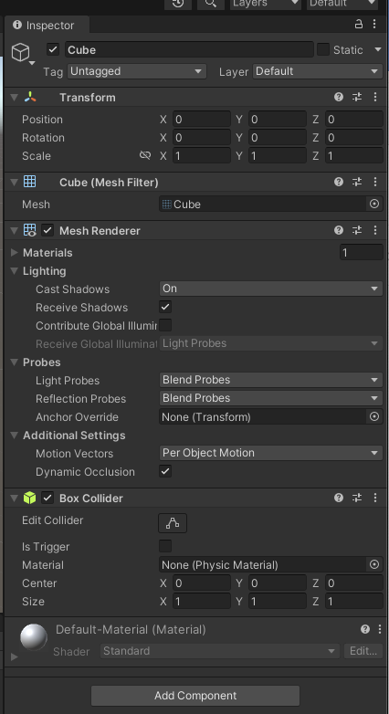
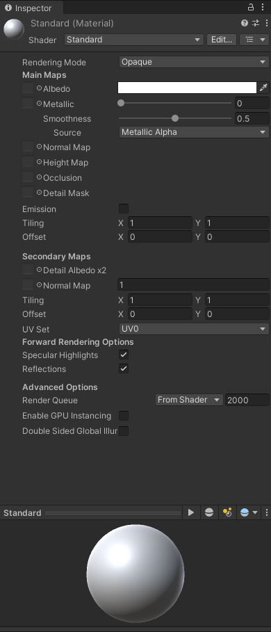
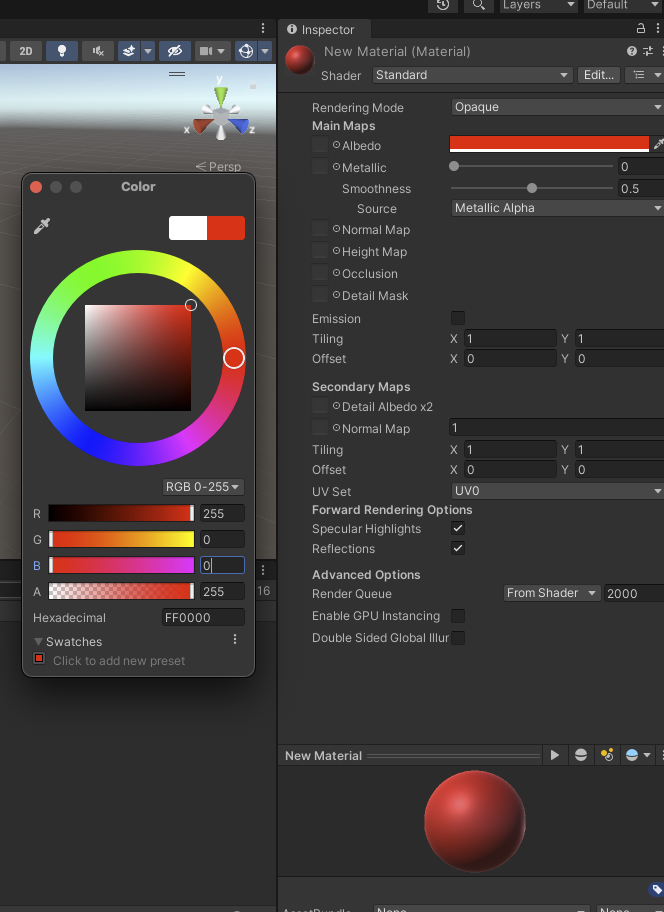
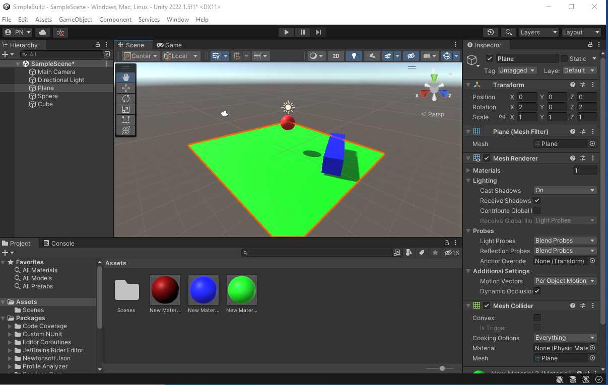

# Getting to know the Unity 3D Editor

The organisation of the main windows might be slightly different, but you should have several key windows:

The _Scene_ View is your interactive view into the world you are creating.

The _Game_ View is rendered from the Camera(s) in your game **if you make changes in Game view these won’t be saved!**.

The _Hierarchy_ window contains a list of every GameObject in the current Scene.

The _Inspector_ window displays detailed information about the currently selected GameObject, including all attached components and their properties, and allows you to modify the functionality of GameObjects in your Scene.

The _Console_ shows errors, warnings and other messages generated by Unity (and your scripts).

## Creating GameObjects

Use the Hierarchy window's "create" tab. Click on this and then select 3D Object - Plane. You should get something like below (but note the first time you do this it may state "importing assets", which may take a while).

This plane is a "GameObject" and should appear as the object "Plane" in your Hierarchy view.

Now use the same method to put a cube (this is another of Unity's basic GameObjects) on the plane, again using the create menu. You should get this:

At this point you should have a white cube embedded in a white plane, not ideal. Both the cube and the plane have the same origin. Select the cube in the Hierarchy menu and you can see its position in the "Transform" component in the Inspector window.

Change the Y position to 2. It should now float above the plane.

## Adding Materials

To add some colour to the cube we need to create a material. In the Project view click the create menu and select "Material". A grey sphere should appear at the bottom of your Inspector view. Towards the top of the Inspector window is a colour chooser (white rectangle) next to the word "Albedo" click on the rectangle and choose a bright red colour (RGB, 255,0,0).

You should also see a red sphere called "New Material" in the assets folder in the project view. Drag this red sphere on to the cube in the Scene view.

Save your scene - File - Save.

## Adding Physics

Now we have something to look at we can play with the view controls.

The _MeshRenderer_ makes the Object visible, try unticking the check box.

The _BoxCollider_ deals with checking for collisions with other game objects, but nothing is moving yet so we have no collisions.

The game view should appear, but nothing should happen the cube just floats above the plane. There are no forces acting on your scene so nothing will move. Click on the play button again to exit game view. Add a _Rigidbody_ component to your cube ( add component, physics, rigidbody).

Now push play and the cube will drop under the influence of gravity till it hits the plane. Play around with the following component options:

1. Turn off the BoxCollider on the cube or the MeshCollider on the plane. What do you think will happen?

2. Try tilting the plane (with the colliders on) by setting the plane's  x and z rotation values to 2. The friction in the rigidbody should stop the cube from sliding. What happens if you set the values to 20 rather than 2? Has your plane disappeared? If it has why do you think?

3. Delete the cube and add a sphere in the same position instead. Now the sphere should hit the plane and roll off.

4. Try adding a cube that the sphere will hit to deflect its movement. Note you can change the dimension of the cube to make it easier to hit.

You should have something like this (I've coloured the objects to make them easier to see).

You might wish to complete lessons 1.1 to 1.4 of [Unity 1 - Player controlLinks to an external site.](https://learn.unity.com/project/unit-1-driving-simulation?missionId=5f71fe63edbc2a00200e9de0&pathwayId=5f7e17e1edbc2a5ec21a20af&contentId=5f7229b2edbc2a001f834db7).