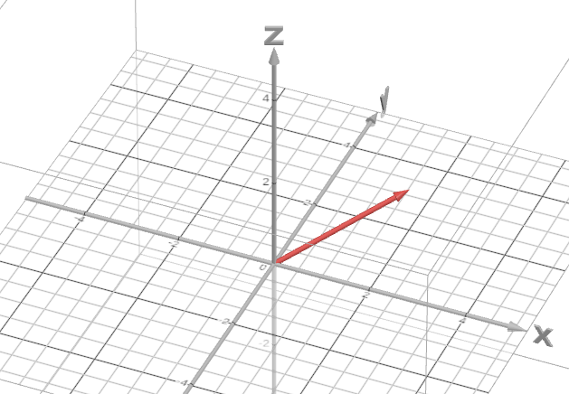
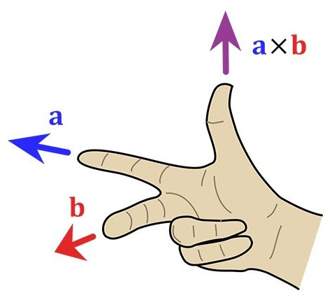
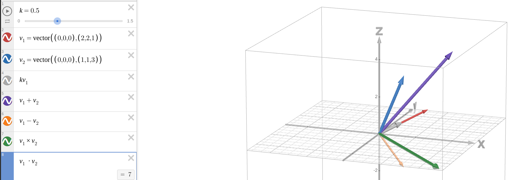

# Vectors

A vector is simply a list of numbers of the form (1,2,3). The dimension of a vector describes how many numbers the vector contains. Vectors may be of any positive dimension, but as game programmers, we are primarily interested in two dimensions (for 2D games) and three dimensions (for 3D games).

A vector can be shown as an arrow that describes a movement from one point to another.

The beauty of such a representation is that it imparts much information because it shows how to travel between points. The size of the arrow shows the vector's magnitude (or how far you have to travel), and where the arrow points shows the vector's direction (or the path the traveller must take).

Vectors are useful for programming motion as they can represent the difference between points in space. Imagine every frame of a running program (a single cycle through a [render loop](https://gameprogrammingpatterns.com/game-loop.html)) during which, an object must be repositioned. The instructions to do so will have a magnitude (how far to travel) and a direction (which way to go); in other words, it will be a vector that represents the object's velocity (defined as the rate of change of the object's position with respect to time). For every frame, this velocity vector determines the object's new position according to a basic algorithm for motion, whereby the new position of the object is equal to the result of applying the velocity vector to the object's current position.

However, Vectors are not limited to simply representing motion. They can also describe absolute positions, adding to their versatility because a vector can define a path from a point of origin (the absolute origin in a 3D space is defined as the vector (0, 0, 0)) to any other point.

The ability of vectors to describe motion and position makes them a fantastic tool for programming a 3D space.

Below are some vector operations.

## Vector Addition and Subtraction

You can add or subtract any two vectors by adding or subtracting their corresponding components:

If 𝐴=(𝑥,𝑦,𝑧) and 𝐵=(𝑥,𝑦,𝑧), then 𝐴 + 𝐵 = (𝑥+𝑥,𝑦+𝑦,𝑧+𝑧)

And

If 𝐴=(𝑥,𝑦,𝑧) and 𝐵=(𝑥,𝑦,𝑧), then 𝐴 - 𝐵 = (𝑥−𝑥,𝑦−𝑦,𝑧−𝑧)

## Magnitude of a Vector

The magnitude of a vector tells us its length. It is denoted by |𝐴|:

If 𝐴=(𝑥,𝑦,𝑧),then |𝐴| =√(x²+y²+z²)

## Unit Vectors

A unit vector is a vector with a magnitude equal to 1.

## Normalising Vectors

Normalisation is the process of making something standard (or normal). The convention is that a normalised vector has a length of 1. Therefore, a normalised vector is a _unit vector_. Because a normalised vector has its length set to 1 but its direction remains unchanged, a normalised (unit) vector describes a vector's direction without regard to its magnitude.

Normalisation is done by dividing a vector's x, y and z components by its magnitude.  

## Multiplying a Vector

To multiply any vector by a scalar number, multiply each vector component by that scalar. Hence:

If 𝐴=(𝑥,𝑦,𝑧), then 𝑘𝐴=(𝑘𝑥,𝑘𝑦,𝑘𝑧) for all real constants 𝑘.

## Dot Product

The dot product takes two vectors and returns a scalar:

If 𝐴=(𝑥,𝑦,𝑧) and 𝐵=(𝑥,𝑦,𝑧), then 𝐴.𝐵 = 𝐴x*𝐵x + 𝐴y*𝐵y + 𝐴z*𝐵z

The dot product may also be derived using a standard trigonometric function:

|𝐴||𝐵| cos θ

The formula above simplifies finding the angle between two vectors, because:

cos θ = (𝐴.𝐵) / |𝐴||𝐵|

Hence, the angle can be found using the inverse cosin of the number derived from the formula above. Now, if the angle between two vectors is 90° (or π/2 radians), then they are orthogonal (or perpendicular) to each other. And for any orthogonal vectors 𝐴 and 𝐵, 𝐴.𝐵 = 0 because cos (π/2) = 0.

The Dot Product is commutable, so 𝐴.𝐵 = 𝐵.𝐴

It is also distributive:

A . (B+C) = (A.B) + (A.C)

Furthermore:

A.A = |𝐴|²

And

0.A = 0

## Cross Product

The cross product of vectors returns a vector that is perpendicular to the plane containing 𝐴 and 𝐵. That's shown using the right-hand thumb rule, whereby the index finger of your right hand is pointed in the direction of 𝐴, and the middle finger is pointed in the direction of 𝐵. The thumb then points up in the direction of 𝐴 × 𝐵.

Formally:

𝐴x𝐵 = |𝐴||𝐵| sinθ n

Where:

- 𝐴 is the first vector
- 𝐵 is the second vector
- θ is the angle between 𝐴 and 𝐵
- n is the unit vector perpendicular to 𝐴 and 𝐵

The cross product can also be found using the determinant of a 3x3 matrix, but that is (currently) beyond the scope of this module.

The magnitude of the cross product vector is:

|𝐴x𝐵| = |𝐴||𝐵| sinθ

The cross product is **not** commutative, since:

Bx𝐴 = -𝐴x𝐵

Neither is it associative:

(𝐴x𝐵)xC ≠ 𝐴x(𝐵xC)

But it is distributive:

𝐴x(𝐵+C) = 𝐴x𝐵+(𝐵xC)

Furthermore:

𝐴x𝐴 = 0

Finally, any two parallel vectors must have a cross product of 0 since they have an angle of zero between them, and the sine of 0 is 0 and multiplication by 0 yields 0.

## The Application of Vector Operations

The image below shows multiplication (by a scalar), addition, subtraction, the dot product and the cross product.

Applications of those operations can help determine how objects move or behave in a 3D space. For example, suppose you have 𝐴 and 𝐵 (where 𝐴 and 𝐵 are the motions of the player and the enemy, respectively), and you want player 𝐵 to move away from the enemy 𝐴. Then 𝐵 = 𝐵 - 𝐴 will do the trick. Dot products are useful because, for any two vectors, 𝐴 and 𝐵, the operation will return a scalar, whereby, if the number is greater than zero, both vectors are in the same direction. However, if the number is less than zero, both vectors are in opposite directions. And if the number is zero, the vectors are perpendicular. So, dot products between two vectors might help you ascertain if any two entities are looking towards the same side, opposite sides, or just looking 90 degrees away from each other.
